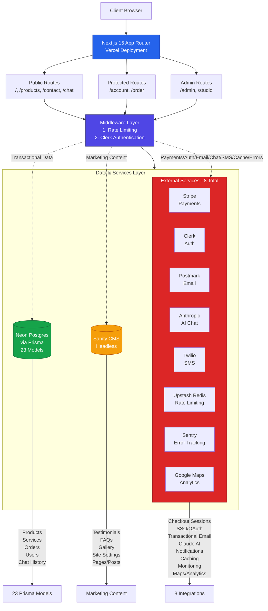

# Architecture Overview

## TL;DR

Muskingum Materials is a full-stack e-commerce platform built on **Next.js 15** (App Router) with **23 Prisma models** backed by Neon Postgres. It integrates **8 external services** (Stripe, Clerk, Sanity, Postmark, Anthropic, Twilio, Upstash, Sentry) with complex data flows spanning authentication, payments, content management, transactional email, and AI-powered chat.

**Key architectural principles:**
- **Two parallel data stores** — Prisma for catalog/transactional data, Sanity for marketing content
- **Graceful degradation** — All external services are optional and fall back gracefully
- **Strict security** — CSP enforcement, rate limiting, server-side price validation, Zod validation at every API boundary
- **Route-level code splitting** — Sanity Studio (~1.86 MB) isolated from main app bundles (~103-148 kB)

**Quick navigation:**
- [System Architecture](#system-architecture)
- [Service Integrations](#service-integrations)
- [Data Flows](#data-flows)
- [Project Structure](#project-structure)
- [Detailed Documentation](#detailed-documentation)

---

## System Architecture

### High-Level Architecture

```
┌─────────────────────────────────────────────────────────────────────┐
│                         Next.js 15 App Router                        │
│                         (Vercel Deployment)                          │
└─────────────────────────────────────────────────────────────────────┘
                                    │
                    ┌───────────────┼───────────────┐
                    │               │               │
            ┌───────▼──────┐ ┌─────▼──────┐ ┌─────▼──────┐
            │   Public      │ │  Protected  │ │   Admin    │
            │   Routes      │ │   Routes    │ │   Routes   │
            │ /, /products, │ │  /account,  │ │   /admin   │
            │  /contact,    │ │   /order    │ │  /studio   │
            │   /chat       │ │             │ │            │
            └───────┬───────┘ └──────┬──────┘ └──────┬─────┘
                    │                │               │
                    └────────────────┼───────────────┘
                                     │
                    ┌────────────────▼────────────────┐
                    │         Middleware              │
                    │  1. Rate Limiting (Upstash)     │
                    │  2. Clerk Authentication        │
                    └────────────────┬────────────────┘
                                     │
        ┌────────────────────────────┼────────────────────────────┐
        │                            │                            │
┌───────▼────────┐         ┌────────▼────────┐         ┌────────▼────────┐
│  Neon Postgres │         │ External Services│         │  Sanity CMS     │
│   (via Prisma) │         │                  │         │  (Headless)     │
│                │         │ • Stripe         │         │                 │
│ • Products     │         │ • Clerk          │         │ • Testimonials  │
│ • Services     │         │ • Postmark       │         │ • FAQs          │
│ • Orders       │         │ • Anthropic      │         │ • Gallery       │
│ • Users        │         │ • Twilio         │         │ • Site Settings │
│ • Chat History │         │ • Upstash Redis  │         │ • Pages/Posts   │
│ • 23 models    │         │ • Sentry         │         │                 │
└────────────────┘         └──────────────────┘         └─────────────────┘
```

### System Architecture Diagram



### Data Store Authority

| Store | Authoritative For | Access Pattern |
|-------|------------------|----------------|
| **Neon Postgres (Prisma)** | Products, Services, Cost Guides, Orders, Leads, Quotes, Chat Conversations, User Profiles, Loyalty Points, Addresses, Newsletter Subscribers | `lib/prisma.ts` singleton client; accessed from API routes and React Server Components |
| **Sanity Studio** | Testimonials, FAQs, Gallery Images, Site Settings (singleton), Pages, Posts | `lib/sanity/client.ts` with GROQ queries; content fetched server-side and cached via `next/cache` |

**Critical:** Products and services exist **only** in Prisma at runtime. Sanity's `product` schema was removed. Prisma is the sole catalog authority.

---

## Service Integrations

### 1. Stripe (Payments)

**Purpose:** Checkout session creation, payment processing, webhook fulfillment

**Files:**
- `app/api/orders/checkout/route.ts` — Creates Stripe Checkout session
- `app/api/orders/webhook/route.ts` — Handles `checkout.session.completed` webhook
- `lib/validate-checkout-prices.ts` — **Trust boundary** — never uses client-supplied prices

**Environment Variables:**
```bash
STRIPE_SECRET_KEY                    # Required for checkout
STRIPE_WEBHOOK_SECRET                # Required for webhook signature verification
NEXT_PUBLIC_STRIPE_PUBLISHABLE_KEY   # Client-side key
```

**Data Flow:**
```
Order Form → POST /api/orders/checkout
  ├─► Zod validation (checkoutSchema)
  ├─► lib/validate-checkout-prices.ts ← Fetches Prisma prices, ignores client prices
  ├─► prisma.order.create({ status: 'pending' })
  └─► stripe.checkout.sessions.create()
        └─► User redirected to Stripe Checkout
              └─► Stripe webhook → POST /api/orders/webhook
                    ├─► Verify signature
                    ├─► Update order status to 'paid'
                    ├─► Award loyalty points
                    └─► Send confirmation email + SMS
```

**Graceful Degradation:**
- When `STRIPE_SECRET_KEY` is missing, checkout returns 503
- Order form still renders; users can request quotes instead

[→ Detailed Stripe Integration Docs](./external-services.md#1-stripe---payment-processing)

---

### 2. Clerk (Authentication)

**Purpose:** User authentication, SSO (Google, GitHub, Apple, Facebook), protected routes

**Files:**
- `middleware.ts` — Dynamically loads Clerk auth if key is present
- `app/layout.tsx` — Wraps app in `ClerkProvider`
- `app/sign-in/[[...sign-in]]/page.tsx`, `app/sign-up/[[...sign-up]]/page.tsx` — Auth pages
- `lib/admin-auth.ts` — Admin role checks

**Environment Variables:**
```bash
NEXT_PUBLIC_CLERK_PUBLISHABLE_KEY    # Required
CLERK_SECRET_KEY                     # Required
NEXT_PUBLIC_CLERK_SIGN_IN_URL=/sign-in
NEXT_PUBLIC_CLERK_SIGN_UP_URL=/sign-up
```

**Protected Routes:**
- `/account/*` — User dashboard, orders, loyalty rewards
- `/admin/*` — Admin back office (requires `publicMetadata.role === 'admin'`)
- `/order` — Checkout flow (guest checkout supported, authenticated preferred)

**Graceful Degradation:**
- When Clerk keys are missing, middleware skips auth
- `ClerkProvider` remains in layout but is harmless
- Protected routes become accessible (dev-only scenario)

**Integration Points:**
- `UserProfile` Prisma model synced via Clerk webhooks
- `userId` foreign key on `Order`, `ChatConversation`, `Lead`, etc.

[→ Detailed Clerk Integration Docs](./authentication.md)

---

### 3. Sanity (Content Management)

**Purpose:** Headless CMS for marketing content, embedded Studio at `/studio`

**Files:**
- `sanity.config.ts` — Studio configuration
- `sanity/schemaTypes/` — Content schemas (7 types)
- `lib/sanity/client.ts` — Sanity client with CDN caching
- `lib/sanity/queries.ts` — GROQ query helpers
- `app/studio/[[...tool]]/page.tsx` — Embedded Studio (catch-all route)

**Schemas (7 total):**
| Schema | Purpose | Singleton |
|--------|---------|-----------|
| `service` | Delivery, loading, pricing descriptions | No |
| `testimonial` | Customer reviews with approval workflow | No |
| `faq` | Questions organized by category | No |
| `galleryImage` | Photos with category tags | No |
| `siteSettings` | Business info, hours, social links | **Yes** |
| `page` | Rich text pages (Portable Text) | No |
| `post` | Blog/news posts | No |

**Environment Variables:**
```bash
NEXT_PUBLIC_SANITY_PROJECT_ID        # Required
NEXT_PUBLIC_SANITY_DATASET           # Required (default: production)
SANITY_API_TOKEN                     # Required for mutations
```

**Bundle Isolation:**
- Sanity Studio (~1.86 MB) is **isolated** to `/studio` route via Next.js code splitting
- Main app bundles (103-148 kB) contain **zero** Studio dependencies
- Verified via `npm run analyze:bundle` (see [bundle-isolation.md](../bundle-isolation.md))

**CSP Requirements:**
- `next.config.ts` allowlists `*.sanity.io`, `*.sanity.network`, Sanity CDN
- `frame-ancestors` allows Sanity hosts for visual editing

[→ Detailed Sanity Integration Docs](./cms-integration.md)

---

### 4. Postmark (Transactional Email)

**Purpose:** Send order confirmations, quote notifications, contact form submissions, newsletter

**Files:**
- `lib/email-service.ts` — Postmark client wrapper
- `lib/email-templates.ts` — Email template builders
- `app/api/orders/webhook/route.ts` — Sends order confirmation
- `app/api/quote/route.ts` — Sends quote notification
- `app/api/contact/route.ts` — Sends contact form submission

**Environment Variables:**
```bash
POSTMARK_API_TOKEN                   # Required
POSTMARK_FROM_EMAIL                  # Required (e.g. orders@muskingummaterials.com)
```

**Email Types:**
- Order confirmation (post-payment)
- Quote request notification (to admin)
- Contact form submission (to admin)
- Newsletter welcome email
- Restock notification (when product back in stock)

**Graceful Degradation:**
- When `POSTMARK_API_TOKEN` is missing, email functions return early with a warning log
- Orders still process; users notified via SMS (if Twilio configured) or UI only

[→ Detailed Email Integration Docs](./external-services.md#4-postmark---transactional-email)

---

### 5. Anthropic (AI Chat)

**Purpose:** AI-powered chat agent for product recommendations, business info, lead capture

**Files:**
- `app/api/chat/route.ts` — Chat API using Vercel AI SDK
- `data/business.ts` — Canonical source for AI system prompt (products, services, hours, contact info)
- `lib/schemas.ts` — Chat message validation

**Model:**
- `claude-haiku-4-5-20251001` via `@ai-sdk/anthropic`

**Environment Variables:**
```bash
ANTHROPIC_API_KEY                    # Optional
```

**Data Flow:**
```
User Message → POST /api/chat
  ├─► Zod validation (chatSchema)
  ├─► Load system prompt from data/business.ts
  ├─► if ANTHROPIC_API_KEY exists:
  │     └─► generateText({ model: 'claude-haiku', ... })
  └─► else:
        └─► getStaticResponse(message) ← Keyword-matched fallback
  ├─► Best-effort persistence:
  │     ├─► prisma.chatConversation.upsert()
  │     └─► prisma.chatMessage.create()
  └─► Return response (DB failures logged but don't fail request)
```

**Lead Capture:**
- When user provides email/phone in chat, creates `Lead` record
- Admin can view leads at `/admin/leads`

**Graceful Degradation:**
- When `ANTHROPIC_API_KEY` is missing, falls back to keyword-matched static responses
- Chat UI still works; responses are rule-based instead of AI-generated

[→ Detailed AI Chat Integration Docs](./chat-system.md)

---

## Data Flows

### Order Flow (End-to-End)

```
1. Cart Management (client-side)
   └─► Zustand store (lib/store.ts) manages cart state

2. Order Form
   └─► app/order/page.tsx
         ├─► Step 1: Google Maps satellite estimator (polygon, area, tonnage)
         ├─► Step 2: Delivery details (address, date, time)
         ├─► Step 3: Contact info + terms acceptance
         └─► Submit → POST /api/orders/checkout

3. Checkout API
   └─► app/api/orders/checkout/route.ts
         ├─► Zod validation (checkoutSchema)
         ├─► lib/validate-checkout-prices.ts ← Fetch Prisma prices
         ├─► prisma.order.create({ status: 'pending', ... })
         └─► stripe.checkout.sessions.create()
               └─► Redirect user to Stripe Checkout

4. Stripe Checkout
   └─► User enters payment info on Stripe-hosted page
         └─► On success → /order/success?session_id=...

5. Stripe Webhook
   └─► POST /api/orders/webhook
         ├─► Verify webhook signature
         ├─► Find order by checkoutSessionId
         ├─► Update order: status = 'paid', paidAt = now
         ├─► Award loyalty points (if user authenticated)
         ├─► Send Postmark order confirmation email
         └─► Send Twilio SMS confirmation (if opted in)

6. Admin Fulfillment
   └─► /admin/orders
         ├─► Update status: processing → out_for_delivery → delivered
         └─► SMS notifications sent on status changes (if opted in)
```

[→ Detailed Order Flow Docs](./order-flow.md)

---

### AI Chat Flow

```
1. User opens chat widget
   └─► components/chat/chat-widget.tsx
         └─► Zustand store tracks conversation state

2. User sends message
   └─► POST /api/chat
         ├─► Zod validation
         ├─► Build system prompt from data/business.ts
         ├─► if ANTHROPIC_API_KEY:
         │     └─► Vercel AI SDK → Anthropic Claude Haiku
         └─► else:
               └─► Keyword-matched static response

3. Response processing
   └─► app/api/chat/route.ts
         ├─► Parse response for contact info (email, phone)
         ├─► if contact info found:
         │     └─► prisma.lead.create()
         ├─► prisma.chatConversation.upsert()
         └─► prisma.chatMessage.create({ role, content })

4. Admin review
   └─► /admin/chat
         └─► View all conversations, leads captured
```

[→ Detailed AI Chat Flow Docs](./chat-system.md)

---

### Authentication Flow

```
1. User visits protected route
   └─► middleware.ts
         ├─► Check Clerk session
         └─► if not authenticated:
               └─► Redirect to /sign-in

2. Sign-in/Sign-up
   └─► app/sign-in/[[...sign-in]]/page.tsx
         └─► Clerk-hosted UI (supports SSO)
               └─► On success → redirect to original destination

3. User Profile Sync
   └─► Clerk webhook → /api/account/webhook
         ├─► On user.created:
         │     └─► prisma.userProfile.create()
         └─► On user.updated:
               └─► prisma.userProfile.update()

4. Admin Access
   └─► /admin/*
         ├─► middleware.ts checks auth
         └─► lib/admin-auth.ts checks role
               └─► if publicMetadata.role !== 'admin':
                     └─► 403 Forbidden
```

[→ Detailed Authentication Flow Docs](./authentication.md)

---

## Project Structure

### Root Directory

```
muskingum-materials/
├── app/                    # Next.js 15 App Router
│   ├── (auth)/            # Auth layout group
│   │   ├── sign-in/
│   │   └── sign-up/
│   ├── account/           # User dashboard (protected)
│   ├── admin/             # Admin back office (protected)
│   ├── api/               # API routes (18 namespaces)
│   │   ├── chat/
│   │   ├── contact/
│   │   ├── leads/
│   │   ├── newsletter/
│   │   ├── orders/        # checkout/, webhook/, [id]/
│   │   ├── quote/
│   │   └── ...
│   ├── calculators/       # Material calculators
│   ├── catalog/           # Product catalog
│   ├── contact/
│   ├── costs/             # Cost guides
│   ├── faq/
│   ├── gallery/
│   ├── order/             # Checkout flow
│   ├── planner/           # Project planner
│   ├── products/
│   ├── services/
│   ├── studio/            # Sanity Studio (catch-all)
│   ├── layout.tsx         # Root layout (ClerkProvider, etc.)
│   ├── page.tsx           # Home page
│   └── globals.css
├── components/            # React components
│   ├── account/
│   ├── admin/
│   ├── analytics/
│   ├── calculators/
│   ├── catalog/
│   ├── chat/
│   ├── contact/
│   ├── delivery/
│   ├── gallery/
│   ├── home/
│   ├── layout/
│   ├── order/
│   ├── planner/
│   ├── recommendations/
│   ├── reviews/
│   ├── rewards/
│   ├── ui/                # Shadcn UI primitives
│   └── error-boundary.tsx
├── lib/                   # Utilities, clients, business logic
│   ├── sanity/            # Sanity client + queries
│   ├── email-templates/   # Postmark templates
│   ├── analytics.ts
│   ├── delivery.ts
│   ├── email-service.ts
│   ├── logger.ts
│   ├── loyalty.ts
│   ├── monitoring.ts      # Sentry integration
│   ├── pricing-calculator.ts
│   ├── prisma.ts          # Prisma client singleton
│   ├── products.ts        # Product/service queries
│   ├── rate-limit.ts      # Upstash Redis rate limiting
│   ├── schemas.ts         # Zod validation schemas
│   ├── sms.ts             # Twilio SMS
│   ├── store.ts           # Zustand state
│   ├── validate-checkout-prices.ts
│   └── ...
├── prisma/
│   ├── schema.prisma      # 23 models
│   └── seed.ts            # Seed script
├── sanity/
│   ├── schemaTypes/       # 7 content schemas
│   └── lib/
├── data/
│   └── business.ts        # Canonical business info (for AI prompts)
├── docs/                  # Architecture documentation (this file!)
│   ├── architecture/
│   │   └── README.md      # ← You are here
│   └── bundle-isolation.md
├── public/                # Static assets
├── scripts/               # Build/verification scripts
├── middleware.ts          # Rate limiting + auth
├── next.config.ts         # CSP, bundle config
├── tailwind.config.ts
├── tsconfig.json
├── package.json
├── CLAUDE.md              # Claude Code guidance
└── README.md              # Project overview
```

### API Routes Overview

| Namespace | Purpose | Rate Limit Tier |
|-----------|---------|-----------------|
| `/api/chat` | AI chat agent | `chat` (5/min) |
| `/api/contact` | Contact form submission | `contact-quote` (10/hr) |
| `/api/quote` | Quote request submission | `contact-quote` (10/hr) |
| `/api/orders/checkout` | Stripe Checkout session creation | `contact-quote` (10/hr) |
| `/api/orders/webhook` | Stripe webhook handler | None (signature-verified) |
| `/api/leads` | Lead capture | `leads-newsletter` (20/hr) |
| `/api/newsletter` | Newsletter signup | `leads-newsletter` (20/hr) |
| `/api/account/*` | User profile, addresses, orders | Auth-protected |
| `/api/admin/*` | Admin back office APIs | Admin-only |
| `/api/revalidate` | On-demand ISR revalidation | Auth-protected |
| `/api/sms/webhook` | Twilio STOP/opt-out handler | None (signature-verified) |

All API routes use **Zod validation** at the boundary (see `lib/schemas.ts`).

---

## Middleware

`middleware.ts` runs on **every non-static request** (matcher excludes `_next`, `images`, `videos`, `favicon.ico`, `studio`).

**Execution order:**
1. **Rate limiting** (Upstash Redis or in-memory fallback)
   - Tiers defined in `lib/rate-limit.ts`
   - 429 responses include `Retry-After` and `X-RateLimit-*` headers
2. **Clerk authentication** (dynamically loaded if key present)
   - Protects `/account/*`, `/admin/*`, etc.

**Adding new rate-limited endpoints:**
1. Add route pattern to `rateLimitedEndpoints` in `middleware.ts`
2. Assign appropriate tier (`chat`, `contact-quote`, or `leads-newsletter`)

---

## Security

### Content Security Policy (CSP)

`next.config.ts` defines a **strict CSP** with explicit allowlists:

| Directive | Allowed Hosts |
|-----------|--------------|
| `script-src` | `'self'`, Clerk, Google Tag Manager, Analytics, Stripe |
| `connect-src` | `'self'`, Clerk, Sanity (WebSocket + API), Stripe, GTM |
| `img-src` | `'self'`, `data:`, `blob:`, Sanity CDN, Unsplash, Stripe, Google |
| `frame-src` | Stripe, Google Maps |
| `frame-ancestors` | Sanity (for visual editing) |

**Adding new third-party hosts:**
1. Update `next.config.ts` CSP directives
2. Test in production mode (`npm run build && npm start`)

### Server-Side Price Validation

**Never trust client-supplied prices.**

`lib/validate-checkout-prices.ts` is the **trust boundary**:
- Fetches product prices from Prisma
- Ignores client-supplied prices
- Validates quantity, discount tiers
- Called by `/api/orders/checkout` before Stripe session creation

### Zod Validation

Every API route validates input with Zod:
- Shared schemas in `lib/schemas.ts`
- Route-specific schemas in route files
- Returns 400 with validation errors on failure

---

## Detailed Documentation

### Data Flows
- [Order Flow](./order-flow.md) — Cart → Checkout → Stripe → Webhook → Email/SMS (9 steps)
- [AI Chat System](./chat-system.md) — User message → API → Anthropic/Fallback → DB → Leads

### Service Integrations
- [External Services](./external-services.md) — Stripe, Postmark, Twilio, Anthropic, Upstash, Neon, Sentry
- [Authentication & Middleware](./authentication.md) — Clerk integration, rate limiting, protected routes
- [Sanity CMS](./cms-integration.md) — Content management, GROQ queries, bundle isolation

### Infrastructure
- [Database Schema](./database-schema.md) — 23 Prisma models, relationships, indexes

---

## Development Workflow

### Local Development

```bash
# Start dev server
npm run dev

# Access Sanity Studio
open http://localhost:3000/studio

# View database in Prisma Studio
npm run db:studio
```

### Database Changes

```bash
# Make changes to prisma/schema.prisma
# Push to Neon (dev)
npm run db:push

# Seed data
npm run db:seed
```

### Production Build

```bash
# Build for production
npm run build

# Verify bundle isolation
npm run analyze:bundle

# Start production server (local)
npm start
```

### Verification Scripts

Manual verification scripts at repo root:

```bash
# Order number generation
node test-order-number.js

# Auth route protection
bash test-protected-routes.sh

# Rate limiting (tests all public APIs)
bash test-rate-limits.sh
```

---

## Deployment

Deployed on **Vercel** with:
- Automatic deployments on push to `main`
- Preview deployments for PRs
- Environment variables in Vercel dashboard

**Critical environment variables for production:**
- `DATABASE_URL` + `DIRECT_URL` (Neon)
- `STRIPE_WEBHOOK_SECRET` (must match Stripe Dashboard webhook)
- All Clerk, Sanity, Postmark keys

**Webhook endpoints (must be registered with providers):**
- Stripe: `https://muskingummaterials.com/api/orders/webhook`
- Clerk: `https://muskingummaterials.com/api/account/webhook`
- Twilio: `https://muskingummaterials.com/api/sms/webhook`

---

## Monitoring & Observability

### Error Tracking (Sentry)

- `lib/monitoring.ts` initializes Sentry
- Captures errors, performance, and breadcrumbs
- Integrated with `lib/logger.ts` for structured logging

### Logging

- `lib/logger.ts` provides structured logging
- JSON output in production
- Sentry breadcrumbs in all log calls
- Request logger middleware in `lib/request-logger.ts`

### Analytics

- Google Analytics 4 (via `NEXT_PUBLIC_GOOGLE_ANALYTICS_ID`)
- Custom event tracking in `lib/analytics.ts`
- Server-side analytics for conversions

---

## Contributing

When making architectural changes:

1. **Update CLAUDE.md** if changing conventions
2. **Update this README** if changing integrations or data flows
3. **Update CSP** in `next.config.ts` if adding third-party hosts
4. **Register rate limiting** in `middleware.ts` for new public APIs
5. **Verify bundle isolation** (`npm run analyze:bundle`) if touching Studio imports
6. **Run verification scripts** before pushing

---

## Questions?

For architectural questions or clarifications:
- See [CLAUDE.md](../../CLAUDE.md) for development conventions
- See detailed integration docs (links above)
- See [README.md](../../README.md) for project overview
