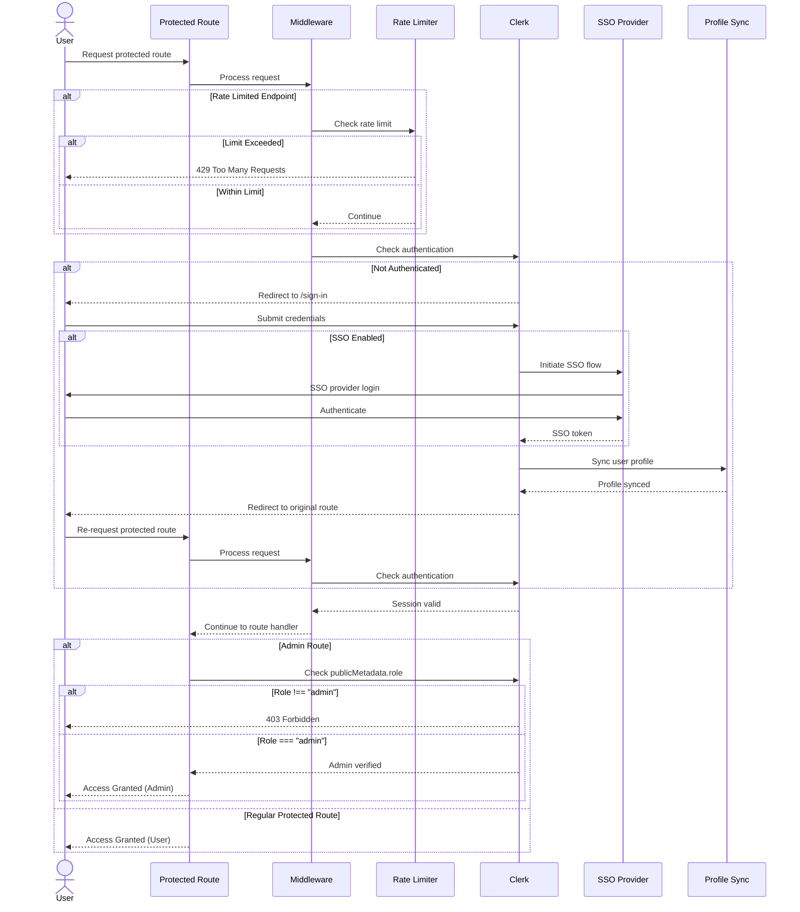

# Authentication & Middleware Flow

## TL;DR

Authentication is handled by **Clerk** with graceful degradation when not configured. **Middleware** runs in a strict order on every non-static request:
1. **Rate limiting** (Upstash Redis or in-memory fallback)
2. **Clerk authentication** (only if configured)

**Key characteristics:**
- **Graceful degradation** — App runs without Clerk; middleware skips auth when `NEXT_PUBLIC_CLERK_PUBLISHABLE_KEY` is missing or placeholder
- **Two-tier authorization** — Regular user auth (`/account`) and admin role checks (`/admin`, admin API routes)
- **Rate limiting first** — Public API endpoints are rate-limited *before* authentication to prevent credential stuffing
- **Per-IP isolation** — Rate limits use `x-forwarded-for` or `x-real-ip` headers (production) or fall back to "unknown" (dev)

**Quick navigation:**
- [Middleware Execution Order](#middleware-execution-order)
- [Rate Limiting](#rate-limiting)
- [Authentication Flow](#authentication-flow)
- [Protected Routes](#protected-routes)
- [Admin Authentication](#admin-authentication)
- [Graceful Degradation](#graceful-degradation)

---

## Middleware Execution Order

**File:** `middleware.ts`

**Matcher:** Excludes `_next`, `images`, `videos`, `favicon.ico`, `studio` static assets

### Execution Flow

```
Request → Middleware matcher
            │
            ├─► 1. Rate Limiting Check (Public API endpoints only)
            │     │
            │     ├─► Get client identifier (x-forwarded-for → x-real-ip → "unknown")
            │     ├─► Check rate limit tier (chat, contact-quote, leads-newsletter)
            │     ├─► Upstash Redis (if configured) OR in-memory Map fallback
            │     └─► Return 429 if exceeded (with Retry-After + X-RateLimit-* headers)
            │
            ├─► 2. Clerk Authentication (Only if NEXT_PUBLIC_CLERK_PUBLISHABLE_KEY set)
            │     │
            │     ├─► Dynamic import @clerk/nextjs/server
            │     ├─► Run clerkMiddleware()
            │     └─► Set session context for downstream route handlers
            │
            └─► 3. Pass through (NextResponse.next())
```

**Critical:** Rate limiting runs *before* authentication to prevent abuse (e.g., credential stuffing, brute force attacks). This means unauthenticated requests can be rate-limited before they ever reach Clerk.

### Rate-Limited Endpoints

**File:** `middleware.ts` (`rateLimitedEndpoints` map)

| Endpoint | Tier | Limit | Window |
|----------|------|-------|--------|
| `/api/chat` | `chat` | 5 requests | 1 minute |
| `/api/contact` | `contact-quote` | 10 requests | 1 hour |
| `/api/quote` | `contact-quote` | 10 requests | 1 hour |
| `/api/orders/checkout` | `contact-quote` | 10 requests | 1 hour |
| `/api/leads` | `leads-newsletter` | 20 requests | 1 hour |
| `/api/newsletter` | `leads-newsletter` | 20 requests | 1 hour |

**Adding a new rate-limited endpoint:**
```typescript
// middleware.ts
const rateLimitedEndpoints: Record<string, RateLimitTier> = {
  "/api/your-endpoint": "contact-quote", // Choose appropriate tier
};
```

---

## Rate Limiting

**File:** `lib/rate-limit.ts`

### Architecture

**Primary:** Upstash Redis (distributed, shared across serverless instances)
**Fallback:** In-memory Map (per-instance, not shared, but prevents build failures)

### Tiers

```typescript
export type RateLimitTier = "chat" | "contact-quote" | "leads-newsletter";
```

| Tier | Limit | Window | Use Cases |
|------|-------|--------|-----------|
| `chat` | 5 | 1 minute | AI chat endpoint (expensive operation) |
| `contact-quote` | 10 | 1 hour | High-value actions (orders, quotes, contact forms) |
| `leads-newsletter` | 20 | 1 hour | Lead capture, newsletter signups |

### Client Identification

**Function:** `getClientIdentifier(request: Request): string`

**Priority:**
1. `x-forwarded-for` header (first IP in comma-separated list)
2. `x-real-ip` header
3. `"unknown"` (fallback — **rate limiting is skipped** to prevent false-positive 429s)

**Security:** When rate limit is exceeded, the client IP is hashed (FNV-1a) before logging to prevent PII leakage in monitoring tools (Sentry, etc.):

```typescript
// middleware.ts
logger.warn("Rate limit exceeded", {
  endpoint: pathname,
  identifierHash: hashIdentifier(identifier), // Not raw IP
  tier: rateLimitTier,
});
```

### Response Headers (429)

When rate limit is exceeded:

```http
HTTP/1.1 429 Too Many Requests
Content-Type: application/json
Retry-After: 3600
X-RateLimit-Limit: 10
X-RateLimit-Remaining: 0
X-RateLimit-Reset: 1716489600000
```

**Body:**
```json
{
  "error": "Too many requests",
  "message": "Rate limit exceeded. Please try again later."
}
```

### In-Memory Fallback

**Class:** `InMemoryStore`

- Used when `UPSTASH_REDIS_REST_URL` or `UPSTASH_REDIS_REST_TOKEN` are missing
- Stores `{ count: number, reset: number }` per key in a `Map`
- Automatic cleanup every 60 seconds (expired entries)
- **Not shared across serverless instances** — each cold start gets a fresh Map

**Trade-off:** In serverless environments (Vercel), each instance has its own rate limit, effectively multiplying limits by the number of active instances. This is acceptable for graceful degradation but not production-grade for high-traffic sites.

---

## Authentication Flow

**Provider:** Clerk (https://clerk.com)

**File:** `app/layout.tsx`

### Conditional Loading

```typescript
const clerkPublishableKey = process.env.NEXT_PUBLIC_CLERK_PUBLISHABLE_KEY;
const hasClerk = Boolean(
  clerkPublishableKey &&
    clerkPublishableKey !== "your_clerk_publishable_key",
);

// ...

return hasClerk ? <ClerkProvider>{tree}</ClerkProvider> : tree;
```

**Why conditional?** Vercel preview builds and local dev may not have Clerk credentials. The app must render without Clerk to avoid build failures.

### Authentication Flow Diagram

The following sequence diagram illustrates the complete authentication flow, including both regular user authentication and admin role verification:



**Flow branches:**
- **Rate limiting** (first): Public API endpoints are checked before authentication to prevent abuse
- **Authentication**: Unauthenticated users are redirected to sign-in (with SSO support)
- **Profile sync**: After successful authentication, user profile is synced to the session
- **Admin check**: Admin routes perform an additional `publicMetadata.role` check after authentication

### Middleware Integration

**File:** `middleware.ts`

```typescript
if (hasClerk) {
  const { clerkMiddleware } = await import("@clerk/nextjs/server");
  const handler = clerkMiddleware();
  const handlerResponse = await handler(request, {} as never);
  return (handlerResponse ?? NextResponse.next()) as NextResponse;
}
```

**Dynamic import:** `@clerk/nextjs/server` is imported at runtime (not top-level) so the build doesn't fail when Clerk env vars are missing.

### Session Access

**In Server Components / API Routes:**

```typescript
import { auth, currentUser } from "@clerk/nextjs/server";

const session = await auth();        // { userId: string } or null
const user = await currentUser();    // Full user object (email, metadata, etc.)
```

**Error handling:** Wrap in `try/catch` to handle cases where Clerk is not configured:

```typescript
let userId: string | null = null;
try {
  const session = await auth();
  userId = session?.userId ?? null;
} catch {
  // Clerk not configured
}
```

---

## Protected Routes

### User-Level Protection

**File:** `app/account/layout.tsx`

**Pattern:** Redirect to sign-in if not authenticated

```typescript
export default async function AccountLayout({
  children,
}: {
  children: React.ReactNode;
}) {
  let userId: string | null = null;
  try {
    const session = await auth();
    userId = session?.userId ?? null;
  } catch {
    // Clerk not configured
  }

  if (!userId) {
    redirect("/sign-in?redirect_url=/account");
  }

  return (
    <div className="py-8">
      {/* Account layout with sidebar */}
    </div>
  );
}
```

**Protected routes:**
- `/account` — User dashboard
- `/account/orders` — Order history
- `/account/saved-orders` — Saved order templates
- `/account/recurring-orders` — Subscription orders
- `/account/rewards` — Loyalty points
- `/account/invoices` — Invoice history

**API routes:**
- `/api/account/profile` — User profile management
- `/api/account/orders` — Fetch user orders
- `/api/account/addresses` — Manage delivery addresses
- `/api/account/loyalty` — Loyalty points balance and redemption
- `/api/account/saved-orders` — Saved order CRUD
- `/api/account/recurring-orders` — Recurring order CRUD

**Access control:** These routes check `session?.userId` and return 401 if missing. User can only access their own data (filtered by `userId` in Prisma queries).

---

## Admin Authentication

### Admin Role Check

**File:** `lib/admin-auth.ts`

**Role storage:** Clerk's `publicMetadata.role` field

### Helper Functions

#### `requireAdmin(): Promise<string>`

**Use case:** Admin pages and API routes that *must* have admin access

**Behavior:**
- Redirects to `/sign-in?redirect_url=/admin` if not authenticated
- Throws `Error("Unauthorized: Admin access required")` if authenticated but not admin
- Returns `userId` if admin

**Example (API route):**
```typescript
import { requireAdmin } from "@/lib/admin-auth";

export async function GET(request: Request) {
  const adminUserId = await requireAdmin(); // Redirects or throws
  // Admin-only logic here
}
```

**Example (Page):**
```typescript
export default async function AdminPage() {
  const adminUserId = await requireAdmin(); // Redirects or throws
  return <div>Admin Dashboard</div>;
}
```

#### `isAdmin(): Promise<boolean>`

**Use case:** Conditional rendering in components (e.g., "Show admin link if user is admin")

**Behavior:**
- Returns `true` if authenticated and has `publicMetadata.role === "admin"`
- Returns `false` otherwise (including when Clerk is not configured)
- Never throws or redirects

**Example (Component):**
```typescript
import { isAdmin } from "@/lib/admin-auth";

export async function Navbar() {
  const showAdminLink = await isAdmin();
  return (
    <nav>
      {showAdminLink && <a href="/admin">Admin</a>}
    </nav>
  );
}
```

### Admin Routes

**Protected pages:**
- `/admin` — Admin dashboard (requires `requireAdmin()` in layout or page)

**Protected API routes:**
- `/api/admin/orders` — Fetch all orders (not filtered by userId)
- `/api/admin/quotes` — Fetch all quote requests
- `/api/admin/leads` — Fetch all leads
- `/api/admin/chats` — Fetch all chat conversations
- `/api/admin/metrics` — Aggregated metrics
- `/api/admin/sms-costs` — SMS cost tracking

**Pattern (inline check):**
```typescript
// app/api/admin/orders/route.ts
export async function GET(request: Request) {
  try {
    let session;
    let user;

    try {
      session = await auth();
      user = await currentUser();
    } catch {
      // Clerk not configured
      return NextResponse.json({ error: "Unauthorized" }, { status: 401 });
    }

    if (!session?.userId) {
      return NextResponse.json({ error: "Unauthorized" }, { status: 401 });
    }

    // Check if user has admin role
    const isAdmin = user?.publicMetadata?.role === "admin";
    if (!isAdmin) {
      return NextResponse.json(
        { error: "Forbidden: Admin access required" },
        { status: 403 }
      );
    }

    // Admin-only logic here
  } catch (error) {
    return NextResponse.json({ error: "Failed to fetch orders" }, { status: 500 });
  }
}
```

**Why inline instead of `requireAdmin()`?** API routes should return JSON errors (401/403), not redirect. The `requireAdmin()` helper is designed for pages (uses `redirect()`).

### Setting Admin Role

**Via Clerk Dashboard:**
1. Go to Clerk Dashboard → Users
2. Select user
3. Edit "Public metadata"
4. Add:
   ```json
   {
     "role": "admin"
   }
   ```
5. Save

**Via Clerk API:**
```typescript
import { clerkClient } from "@clerk/nextjs/server";

await clerkClient.users.updateUserMetadata(userId, {
  publicMetadata: {
    role: "admin",
  },
});
```

---

## Graceful Degradation

### When Clerk is Not Configured

**Environment variable check:**
```typescript
const hasClerk = Boolean(
  process.env.NEXT_PUBLIC_CLERK_PUBLISHABLE_KEY &&
    process.env.NEXT_PUBLIC_CLERK_PUBLISHABLE_KEY !== "your_clerk_publishable_key"
);
```

**Behavior:**

| Component | With Clerk | Without Clerk |
|-----------|-----------|---------------|
| `middleware.ts` | Runs `clerkMiddleware()` | Skips Clerk, returns `NextResponse.next()` |
| `app/layout.tsx` | Wraps tree in `<ClerkProvider>` | Renders tree directly (no provider) |
| `/account/*` pages | Redirects to `/sign-in` if not authenticated | Redirects to `/sign-in` (sign-in page will show error or fallback UI) |
| `/admin/*` pages | Checks admin role, throws/redirects | Redirects to `/sign-in` |
| API routes (user) | Returns 401 if not authenticated | Returns 401 (Clerk SDK throws, caught by `try/catch`) |
| API routes (admin) | Returns 401/403 based on role | Returns 401 (Clerk SDK throws, caught by `try/catch`) |

**Fallback UI:** `/sign-in` and `/sign-up` pages should handle the case where Clerk is not configured (show message like "Authentication not configured" instead of crashing).

### Why This Design?

**Use cases:**
- **Preview deployments** — Vercel preview branches may not have Clerk credentials
- **Local development** — Developers without Clerk accounts can still run the app
- **Open-source deployments** — Forks can run without setting up Clerk immediately

**Trade-off:** Protected routes are not truly "protected" without Clerk, but they degrade to redirects (which would fail at sign-in page) rather than crashing the build.

---

## Environment Variables

### Required for Authentication

```bash
NEXT_PUBLIC_CLERK_PUBLISHABLE_KEY  # Clerk publishable key (client-side)
CLERK_SECRET_KEY                   # Clerk secret key (server-side)
```

**Placeholder detection:** If `NEXT_PUBLIC_CLERK_PUBLISHABLE_KEY` is set to `"your_clerk_publishable_key"` (common in `.env.example` files), it's treated as missing.

### Required for Rate Limiting (Optional)

```bash
UPSTASH_REDIS_REST_URL    # Upstash Redis REST URL
UPSTASH_REDIS_REST_TOKEN  # Upstash Redis REST token
```

**Fallback:** In-memory Map (per-instance, not shared)

---

## Security Considerations

### 1. Rate Limiting Before Auth

Rate limiting runs *before* authentication to prevent:
- **Credential stuffing** — Attackers trying many username/password combinations
- **Brute force** — Repeated login attempts
- **Resource exhaustion** — Expensive operations (like AI chat) called without auth

### 2. Client IP Hashing

When rate limits are exceeded, client IPs are hashed (FNV-1a) before logging to Sentry or other monitoring tools. This prevents PII (Personally Identifiable Information) from being stored in logs.

**File:** `middleware.ts`

```typescript
function hashIdentifier(id: string): string {
  let h = 2166136261;
  for (let i = 0; i < id.length; i++) {
    h ^= id.charCodeAt(i);
    h = Math.imul(h, 16777619);
  }
  return (h >>> 0).toString(16).padStart(8, "0");
}

logger.warn("Rate limit exceeded", {
  identifierHash: hashIdentifier(identifier), // Not raw IP
});
```

### 3. Admin Role in Public Metadata

Clerk's `publicMetadata` is **readable by the client** but **only writable by the server or Clerk Dashboard**. This is safe for role checks because:
- Client cannot forge `publicMetadata` (Clerk API enforces server-side writes only)
- `publicMetadata` is cryptographically signed in the session token
- Tampering with the token invalidates the signature

**Do NOT store sensitive data in `publicMetadata`** (e.g., credit card numbers, passwords). Use `privateMetadata` for sensitive fields.

### 4. Redirect URLs

**Protected routes:** Always redirect to `/sign-in?redirect_url=<original-path>` so users return to the intended page after authentication.

**Example:**
```typescript
if (!userId) {
  redirect("/sign-in?redirect_url=/account");
}
```

Clerk's `<SignIn>` component automatically reads `redirect_url` from the query string and redirects after successful sign-in.

### 5. Double-Check Auth in API Routes

**Never trust client-supplied userId.** Always fetch `session` from Clerk's server-side SDK:

```typescript
// ❌ WRONG: Client sends userId in request body
const { userId } = await request.json();
const orders = await prisma.order.findMany({ where: { userId } });

// ✅ CORRECT: Get userId from Clerk session
const session = await auth();
if (!session?.userId) {
  return NextResponse.json({ error: "Unauthorized" }, { status: 401 });
}
const orders = await prisma.order.findMany({ where: { userId: session.userId } });
```

---

## Testing

### Manual Testing

**Test rate limiting:**
```bash
./test-rate-limits.sh
```

Verifies:
- All public API endpoints return 429 after exceeding limits
- `Retry-After` and `X-RateLimit-*` headers are present
- Per-IP isolation (different IPs have independent limits)

**Test protected routes:**
```bash
./test-protected-routes.sh
```

Verifies:
- `/account` redirects to `/sign-in` when not authenticated
- `/account` renders when authenticated
- `/admin` returns 403 for non-admin users

### Unit Testing (Future)

**Rate limiting:**
- Mock Upstash Redis with in-memory store
- Test sliding window behavior
- Test per-tier limits

**Admin auth:**
- Mock Clerk session with different `publicMetadata` values
- Test `requireAdmin()` redirect and throw behavior
- Test `isAdmin()` return values

---

## Troubleshooting

### Issue: Rate limit skipped (identifier = "unknown")

**Symptom:** Logs show `"Rate limit skipped: client identifier unavailable"`

**Cause:** Request headers `x-forwarded-for` and `x-real-ip` are missing (common in local dev)

**Solution:**
- In production (Vercel), these headers are set automatically by the load balancer
- In local dev, rate limiting falls back to `"unknown"` and is skipped to prevent false-positive 429s

**To test rate limiting locally:**
```bash
curl -H "x-forwarded-for: 192.168.1.1" http://localhost:3000/api/chat
```

### Issue: Clerk not found error

**Symptom:** Build fails with `Module not found: Can't resolve '@clerk/nextjs/server'`

**Cause:** `@clerk/nextjs` is not installed

**Solution:**
```bash
npm install @clerk/nextjs
```

### Issue: ClerkProvider publishableKey warning

**Symptom:** Warning in console: `ClerkProvider: Missing publishableKey`

**Cause:** `NEXT_PUBLIC_CLERK_PUBLISHABLE_KEY` is not set or is set to placeholder value

**Solution:**
- If you want Clerk: Set real Clerk credentials in `.env.local`
- If you don't want Clerk: Ignore warning (app will work without auth)

### Issue: Admin routes return 401 instead of 403

**Symptom:** Admin user gets 401 (Unauthorized) instead of 403 (Forbidden)

**Cause:** `publicMetadata.role` is not set to `"admin"` in Clerk Dashboard

**Solution:**
1. Go to Clerk Dashboard → Users
2. Edit user's public metadata
3. Add `{ "role": "admin" }`
4. Save and try again

### Issue: Rate limit persists across server restarts (in-memory)

**Symptom:** After restarting dev server, rate limits are reset

**Cause:** In-memory store (Map) is cleared on server restart

**Solution:**
- Expected behavior with in-memory fallback
- Use Upstash Redis for persistent rate limiting in production

---

## Related Documentation

- [Chat System](./chat-system.md) — AI chat flow (rate-limited at 5/minute)
- [Order Flow](./order-flow.md) — Order checkout (rate-limited at 10/hour)
- [System Architecture](./README.md) — High-level overview
