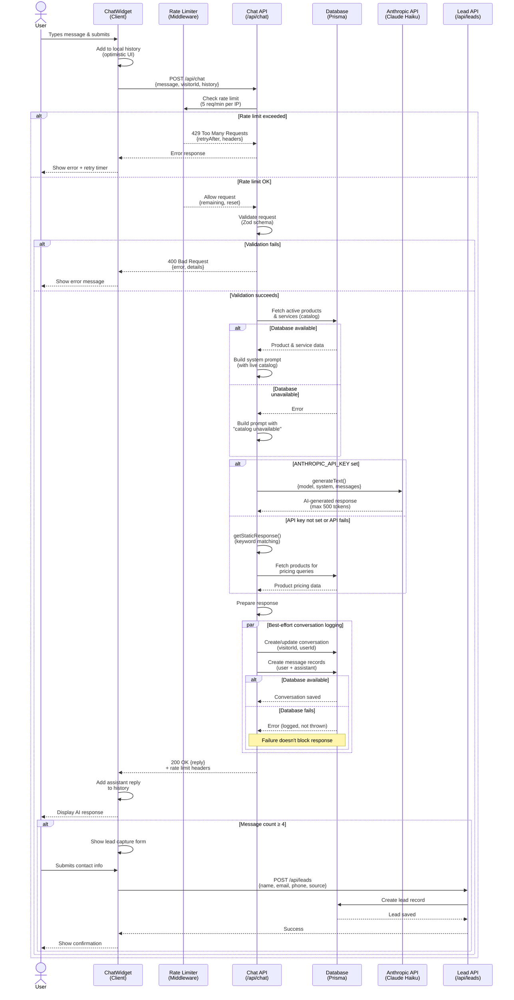

# AI Chat System Architecture

## Overview

The AI chat system provides real-time customer support through an intelligent conversational interface powered by Anthropic's Claude API with graceful degradation to static responses. The system handles product inquiries, pricing information, and business hours while capturing conversation data and generating qualified leads.

## Request Flow Diagram

The following sequence diagram illustrates the complete chat interaction flow, including rate limiting, AI generation with fallback, database persistence, and lead capture:



**Key Flow Characteristics:**

- **Rate Limiting First:** All requests pass through middleware rate limiting before reaching the API handler
- **Graceful Degradation:** System continues functioning when Anthropic API or database are unavailable
- **Optimistic UI:** User messages appear immediately; errors roll back the UI state
- **Best-Effort Persistence:** Database logging failures are logged but don't fail the user's request
- **Conditional Lead Capture:** Form only appears after 4+ messages to qualify engaged visitors
- **No Authentication Required:** System uses anonymous `visitorId` tracking; authenticated users get their `userId` linked to conversations

## System Components

### 1. Client Layer (Chat Widget)

**Location:** `components/chat/chat-widget.tsx`

The chat widget is a client-side React component that provides the user interface for customer interactions.

**Key Features:**
- Persistent visitor ID tracking across sessions
- Auto-focus on open for accessibility
- Automatic welcome message on first interaction
- Optimistic UI updates with loading states
- Error handling with fallback contact information
- Optional lead capture form after engagement threshold

**State Management:**
- Uses Zustand store (`lib/store.ts`) for:
  - Chat open/closed state
  - Message history (persistent across page navigation)
  - Unique visitor ID generation and storage

**User Flow:**
1. User clicks floating chat button (bottom-right)
2. Widget opens with automatic welcome message
3. User types message and submits
4. Message appears immediately (optimistic UI)
5. Loading indicator displays while waiting for response
6. Assistant response appears when received
7. After 4+ messages, optional contact form appears for lead capture

### 2. Rate Limiting Layer (Middleware)

**Location:** `middleware.ts`, `lib/rate-limit.ts`

Rate limiting protects the chat API from abuse while allowing legitimate usage.

**Configuration:**
- **Tier:** `chat`
- **Limit:** 5 requests per minute per client IP
- **Storage:** Upstash Redis (production) or in-memory Map (development)

**Implementation:**
```typescript
// middleware.ts
const rateLimitedEndpoints = {
  "/api/chat": "chat",  // 5 requests/minute
  // ...other endpoints
};
```

**Rate Limit Response (HTTP 429):**
```json
{
  "error": "Too many requests. Please try again later.",
  "retryAfter": 42
}
```

**Headers:**
- `X-RateLimit-Limit`: Maximum requests allowed
- `X-RateLimit-Remaining`: Requests remaining in current window
- `X-RateLimit-Reset`: Timestamp when limit resets (milliseconds)
- `Retry-After`: Seconds until client should retry

**Fallback Behavior:**
- When Redis is unavailable, falls back to in-memory rate limiting
- When client IP cannot be determined (`identifier === "unknown"`), rate limiting is skipped with warning log

### 3. API Route Layer

**Location:** `app/api/chat/route.ts`

The API route handles chat message processing with validation, AI generation, and persistence.

#### Request Validation

Uses Zod schema for type-safe validation:

```typescript
const chatSchema = z.object({
  message: z.string().min(1).max(5000),
  visitorId: z.string().min(1).max(100).optional(),
  history: z.array(z.object({
    role: z.enum(["user", "assistant"]),
    content: z.string().max(5000),
  })).max(50).optional().default([]),
});
```

**Constraints:**
- Message: 1-5000 characters
- Visitor ID: 1-100 characters (optional)
- History: Maximum 50 messages, 5000 chars each
- Invalid requests return HTTP 400 with detailed error information

#### System Prompt Building

The system prompt is dynamically constructed from multiple sources to ensure chat responses stay synchronized with current business data:

**Sources:**
1. **Static Business Info** (`data/business.ts`):
   - Company name, address, contact information
   - Business hours, tagline, payment methods
   - Tax rate (7.25%) and credit card processing fee (4.5%)

2. **Live Product Catalog** (Prisma):
   - Active products with current pricing
   - Sorted by `sortOrder`
   - Includes name, price, unit, and description
   - Falls back gracefully if database is unreachable

3. **Live Services Catalog** (Prisma):
   - Active services with descriptions
   - Sorted by `sortOrder`

**Prompt Structure:**
```
You are a friendly, knowledgeable customer service assistant for Muskingum Materials...

BUSINESS INFORMATION:
- Name: Muskingum Materials
- Address: 1133 Ellis Dam Rd, Zanesville, OH 43701
- Phone: (740) 319-0183
...

PRODUCTS AND PRICING (live from catalog):
- [Dynamic product list from database]

SERVICES:
- [Dynamic service list from database]

GUIDELINES:
- Be friendly, helpful, and concise
- Always provide accurate pricing from the data above
- Keep responses brief (2-3 sentences max)
- Never make up information
...
```

**Database Failure Handling:**
- On catalog fetch failure: Falls through with empty product/service lists
- Prompt indicates "(catalog temporarily unavailable — direct customers to call)"
- Static fallback responses take over (see below)

### 4. AI Integration Layer

**Location:** `app/api/chat/route.ts` (Anthropic integration)

#### Primary: Anthropic Claude API

When `ANTHROPIC_API_KEY` environment variable is configured:

**Model:** `claude-haiku-4-5-20251001` (Claude Haiku 4.5)
**Provider:** Vercel AI SDK with `@ai-sdk/anthropic`

**Configuration:**
```typescript
const result = await generateText({
  model: anthropic("claude-haiku-4-5-20251001"),
  system: systemPrompt,
  messages: conversationHistory,
  maxOutputTokens: 500,
});
```

**Conversation Context:**
- All history entries forwarded from the client request
- Current user message
- System prompt with live catalog data

**Token Limit:**
- Maximum 500 output tokens per response
- Ensures responses stay concise and fast
- Typical responses are 50-150 tokens (2-3 sentences)

#### Fallback: Static Keyword Responses

When `ANTHROPIC_API_KEY` is not configured or API call fails:

**Function:** `getStaticResponse(message: string)`

**Keyword Matching:**
| Keywords | Response Type |
|----------|---------------|
| "price", "cost", "how much" | Product pricing (fetches top 5 from database) |
| "hour", "open", "close" | Business hours |
| "deliver" | Delivery information |
| "location", "where", "address", "direction" | Physical address |
| "payment", "pay", "credit", "cash" | Payment methods and fees |
| Default | General contact information |

**Example Static Response:**
```javascript
// User: "What are your hours?"
// Response:
"We're open Monday through Friday, 7:30 AM to 4:00 PM. 
We're closed on weekends. Come on by or call (740) 319-0183!"
```

### 5. Conversation Storage Layer

**Location:** Prisma models in `prisma/schema.prisma`

#### Database Models

**ChatConversation:**
```prisma
model ChatConversation {
  id        String   @id @default(cuid())
  visitorId String   @unique
  name      String?
  email     String?
  phone     String?
  status    String   @default("active")
  metadata  Json?
  messages  ChatMessage[]
  createdAt DateTime @default(now())
  updatedAt DateTime @updatedAt
}
```

**ChatMessage:**
```prisma
model ChatMessage {
  id             String           @id @default(cuid())
  conversationId String
  conversation   ChatConversation @relation(...)
  role           String           // "user" | "assistant"
  content        String           @db.Text
  createdAt      DateTime         @default(now())
}
```

#### Storage Process

**Conversation Upsert:**
```typescript
const conversation = await prisma.chatConversation.upsert({
  where: { visitorId },
  update: { updatedAt: new Date() },
  create: { visitorId },
});
```

**Message Batch Insert:**
```typescript
await prisma.chatMessage.createMany({
  data: [
    { conversationId: conversation.id, role: "user", content: userMessage },
    { conversationId: conversation.id, role: "assistant", content: assistantReply }
  ],
});
```

**Error Handling:**
- Database failures are logged but don't fail the request
- Users still receive AI responses even if storage fails
- Ensures uptime during database issues

**Best-Effort Persistence:**
```typescript
try {
  // Store conversation...
} catch (error) {
  logger.error("Chat DB save error", error, { visitorId });
  // Request continues successfully
}
```

### 6. Lead Capture Flow

**Location:** `components/chat/chat-widget.tsx` (lines 69-109)

Lead capture converts engaged chat visitors into actionable sales leads.

#### Trigger Conditions

**Engagement Threshold:**
- Automatically triggers after user sends 4+ messages
- Indicates genuine interest (not just casual browsing)
- Shows once per session (tracked by `contactSubmitted` state)

**Display Logic:**
```typescript
if (messages.length >= 4 && !contactSubmitted && !showContactForm) {
  setShowContactForm(true);
}
```

#### Lead Capture Form

**Form Fields:**
- Name (text)
- Email (email, validated)
- Phone (text, optional)

**User Experience:**
- Non-intrusive inline form in chat scroll area
- Optional - users can skip without penalty
- Submit or skip both dismiss the form
- Thank you message appears after submission

#### Lead Submission

**API Endpoint:** `/api/leads`
**Method:** POST
**Rate Limit:** 20 requests/hour (leads-newsletter tier)

**Payload:**
```json
{
  "name": "John Doe",
  "email": "john@example.com",
  "phone": "740-555-0123",
  "source": "chat",
  "visitorId": "anon-uuid-here"
}
```

**Success Flow:**
1. Form submitted to `/api/leads`
2. Lead stored in database with `source: "chat"`
3. Form hidden, `contactSubmitted` flag set
4. Personalized thank-you message appears in chat
5. Conversation continues normally

**Error Handling:**
- Network failures show toast notification
- Form is hidden to prevent frustration
- User can continue chatting without interruption

## Data Flow Diagram

```
┌─────────────────────────────────────────────────────────────────┐
│ User Interface (Chat Widget)                                    │
│ - Visitor ID generation/storage                                 │
│ - Message history (Zustand)                                     │
│ - Lead capture form (4+ messages)                               │
└───────────────────────┬─────────────────────────────────────────┘
                        │
                        ▼ POST /api/chat
┌─────────────────────────────────────────────────────────────────┐
│ Middleware (middleware.ts)                                      │
│ ┌─────────────────────────────────────────────────────────────┐ │
│ │ Rate Limiting (5 req/min)                                   │ │
│ │ - Check Upstash Redis / in-memory                           │ │
│ │ - Return 429 if exceeded                                    │ │
│ │ - Add X-RateLimit-* headers                                 │ │
│ └─────────────────────────────────────────────────────────────┘ │
│ ┌─────────────────────────────────────────────────────────────┐ │
│ │ Request Logging                                             │ │
│ │ - Log incoming request                                      │ │
│ │ - Track duration                                            │ │
│ └─────────────────────────────────────────────────────────────┘ │
└───────────────────────┬─────────────────────────────────────────┘
                        │
                        ▼
┌─────────────────────────────────────────────────────────────────┐
│ API Route (app/api/chat/route.ts)                               │
│ ┌─────────────────────────────────────────────────────────────┐ │
│ │ 1. Request Validation (Zod)                                 │ │
│ │    - message: 1-5000 chars                                  │ │
│ │    - visitorId: optional                                    │ │
│ │    - history: max 50 messages                               │ │
│ └─────────────────────────────────────────────────────────────┘ │
│                                                                   │
│ ┌─────────────────────────────────────────────────────────────┐ │
│ │ 2. Build System Prompt                                      │ │
│ │    ┌───────────────────────────────────────────────────────┐│ │
│ │    │ Static Data (data/business.ts)                        ││ │
│ │    │ - Company info, hours, payment methods                ││ │
│ │    └───────────────────────────────────────────────────────┘│ │
│ │    ┌───────────────────────────────────────────────────────┐│ │
│ │    │ Live Catalog (Prisma)                                 ││ │
│ │    │ - Products: active, sorted by sortOrder               ││ │
│ │    │ - Services: active, sorted by sortOrder               ││ │
│ │    │ - Fallback: empty lists if DB fails                   ││ │
│ │    └───────────────────────────────────────────────────────┘│ │
│ └─────────────────────────────────────────────────────────────┘ │
│                                                                   │
│ ┌─────────────────────────────────────────────────────────────┐ │
│ │ 3. Generate Response                                        │ │
│ │    ┌───────────────────────────────────────────────────────┐│ │
│ │    │ Primary: Anthropic Claude API                         ││ │
│ │    │ - Model: claude-haiku-4-5-20251001                    ││ │
│ │    │ - Max tokens: 500                                     ││ │
│ │    │ - Context: system prompt + last 10 messages           ││ │
│ │    └───────────────────────────────────────────────────────┘│ │
│ │    ┌───────────────────────────────────────────────────────┐│ │
│ │    │ Fallback: Static Responses                            ││ │
│ │    │ - Keyword matching (price, hours, delivery, etc.)     ││ │
│ │    │ - Fetches top 5 products for pricing queries          ││ │
│ │    │ - Returns contact info as default                     ││ │
│ │    └───────────────────────────────────────────────────────┘│ │
│ └─────────────────────────────────────────────────────────────┘ │
│                                                                   │
│ ┌─────────────────────────────────────────────────────────────┐ │
│ │ 4. Store Conversation (Best-Effort)                         │ │
│ │    ┌───────────────────────────────────────────────────────┐│ │
│ │    │ ChatConversation (upsert by visitorId)                ││ │
│ │    └───────────────────────────────────────────────────────┘│ │
│ │    ┌───────────────────────────────────────────────────────┐│ │
│ │    │ ChatMessage (batch insert user + assistant)           ││ │
│ │    └───────────────────────────────────────────────────────┘│ │
│ │    - Errors logged but don't fail request                   │ │
│ └─────────────────────────────────────────────────────────────┘ │
│                                                                   │
│ ┌─────────────────────────────────────────────────────────────┐ │
│ │ 5. Return Response                                          │ │
│ │    { "reply": "..." }                                       │ │
│ └─────────────────────────────────────────────────────────────┘ │
└───────────────────────┬─────────────────────────────────────────┘
                        │
                        ▼
┌─────────────────────────────────────────────────────────────────┐
│ Chat Widget (Display Response)                                  │
│ - Add assistant message to UI                                   │
│ - Check message count for lead capture trigger (>= 4)           │
└───────────────────────┬─────────────────────────────────────────┘
                        │
                        ▼ (if messages >= 4)
┌─────────────────────────────────────────────────────────────────┐
│ Lead Capture Form                                                │
│ - Display inline form (name, email, phone)                      │
│ - Submit to POST /api/leads with source: "chat"                 │
│ - Store Lead in database                                        │
│ - Show thank-you message                                        │
│ - Continue conversation                                         │
└─────────────────────────────────────────────────────────────────┘
```

## Error Handling Strategy

### Client-Side Errors

**Network Failures:**
```typescript
// Destructured toast displayed to user
toast({
  title: "Connection Error",
  description: "Unable to send message. Please call us at (740) 319-0183...",
  variant: "destructive",
});
```

**Behavior:**
- User message remains visible (optimistic UI)
- Assistant response not added
- User can retry by sending another message
- Contact information always provided as fallback

### Server-Side Errors

**Validation Errors (HTTP 400):**
```json
{
  "error": "Invalid request data",
  "details": [
    {
      "code": "too_big",
      "maximum": 5000,
      "path": ["message"]
    }
  ]
}
```

**Processing Errors (HTTP 200):**
- Graceful degradation to contact information
- No error status code (prevents generic browser error pages)
- Returns helpful fallback message:
  ```json
  {
    "reply": "I'm having trouble right now. Please call us at (740) 319-0183 for immediate assistance!"
  }
  ```

**Database Errors:**
- Conversation storage failures are logged but silent to user
- System prompt building failures fall back to empty catalog
- Static responses still work when database is down

### Logging Strategy

**Structured JSON Logging:**
All logs use `lib/logger.ts` for consistent structured output with Sentry integration:

```typescript
logger.info("Chat request rate limit check", {
  identifier: clientIp,
  success: true,
  remaining: 3,
  limit: 5,
});

logger.error("Chat DB save error", error, {
  visitorId: "anon-12345"
});
```

**Log Levels:**
- `debug`: Development diagnostics
- `info`: Rate limit checks, successful operations
- `warn`: Rate limit approaching/exceeded, missing configuration
- `error`: API failures, database errors, unexpected exceptions

## Configuration

### Environment Variables

| Variable | Required | Purpose | Fallback |
|----------|----------|---------|----------|
| `ANTHROPIC_API_KEY` | No | Claude API access | Static keyword responses |
| `DATABASE_URL` | Yes | Prisma database connection | N/A - app fails |
| `DIRECT_URL` | Yes | Direct database access | N/A - app fails |
| `UPSTASH_REDIS_REST_URL` | No | Rate limiting storage | In-memory Map |
| `UPSTASH_REDIS_REST_TOKEN` | No | Rate limiting auth | In-memory Map |

### Rate Limiting Configuration

**Production (Upstash Redis):**
```typescript
const chatLimiter = new Ratelimit({
  redis,
  limiter: Ratelimit.slidingWindow(5, "1 m"),
  analytics: true,
  prefix: "@ratelimit/chat",
});
```

**Development (In-Memory):**
```typescript
// Automatically used when Redis credentials not provided
// Cleanup runs every 60 seconds
setInterval(() => inMemoryStore.cleanup(), 60000);
```

## Performance Considerations

### Response Time Targets

| Operation | Target | Notes |
|-----------|--------|-------|
| Rate limit check | < 10ms | Redis RTT or in-memory lookup |
| System prompt build | < 100ms | Depends on database latency |
| Claude API call | < 2s | Model: Haiku (fastest), 500 token limit |
| Static response | < 50ms | Keyword matching + optional DB query |
| Conversation storage | < 100ms | Non-blocking, best-effort |

### Optimization Strategies

**Message History Limiting:**
- Client sends last 10 messages only
- Reduces payload size and token usage
- Maintains sufficient context for continuity

**Token Optimization:**
- Max 500 output tokens enforces conciseness
- System prompt is compact (~800 tokens)
- Typical total: ~1200 tokens per request

**Database Optimization:**
- Product/service queries indexed on `active` and `sortOrder`
- Conversation upsert uses unique index on `visitorId`
- Batch message insert reduces round trips

**Graceful Degradation:**
- Missing AI API → Static responses (no external dependencies)
- Missing Redis → In-memory rate limiting
- Database failure → Empty catalog but chat still functions

## Security Considerations

### Input Validation

**Zod Schema Enforcement:**
- Maximum message length (5000 chars) limits resource abuse (not a prompt injection prevention control)
- History size limit (50 messages) prevents memory exhaustion
- Visitor ID validation prevents injection

**Rate Limiting:**
- Prevents abuse and DDoS attacks
- Per-IP tracking with privacy-preserving hash for logs
- Automatic retry-after signaling

### Privacy

**Visitor Tracking:**
- Client-generated UUID (anonymous)
- No cookies required
- IP addresses hashed (FNV-1a) before logging to prevent PII in monitoring

**Data Retention:**
- Conversation history stored indefinitely (business requirement)
- No automatic deletion (manual purge possible via Prisma)
- PII in logs is hashed

### AI Safety

**System Prompt Guardrails:**
- "Never make up information not provided above"
- Directs to human contact for unknown queries
- Maximum token limit prevents overly long responses

**Fallback Safety:**
- Static responses hardcoded and reviewed
- No user input passed to templates
- Contact information always accurate

## Monitoring and Observability

### Key Metrics

**Request Metrics:**
- Rate limit check results (success/failure)
- Rate limit remaining counts
- Rate limit exceeded events (429 responses)

**Performance Metrics:**
- Response generation time (AI vs static)
- Database query latency
- End-to-end request duration

**Error Metrics:**
- AI API failures
- Database connection failures
- Validation error rates

**Business Metrics:**
- Conversations initiated
- Messages per conversation
- Lead capture rate (conversions after 4+ messages)

### Logging Points

1. **Middleware:** Rate limit check results
2. **API Route:** Request validation, AI generation, DB storage
3. **System Prompt Builder:** Catalog fetch failures
4. **Static Fallback:** Keyword match selection

### Alerts

**Critical:**
- Database connection failure rate > 5%
- AI API failure rate > 10%
- Rate limit exceeded rate > 20% of traffic

**Warning:**
- Redis connection failures (fallback to in-memory)
- Conversation storage failures > 1%
- Rate limit remaining ≤ 1 (approaching limit)

## Future Enhancements

### Planned Improvements

1. **Conversation Analytics:**
   - Track common user intents
   - Identify frequently asked questions
   - Measure response satisfaction

2. **Enhanced Lead Qualification:**
   - Intent detection (pricing, delivery, specific products)
   - Auto-categorize leads by interest area
   - CRM integration for automatic follow-up

3. **Multi-turn Context:**
   - Store full conversation context in database
   - Resume conversations across sessions
   - Personalization based on previous interactions

4. **A/B Testing:**
   - Test different lead capture thresholds
   - Experiment with prompt variations
   - Optimize response conciseness

5. **Real-time Handoff:**
   - Escalate complex queries to human agents
   - Live chat integration for urgent needs
   - Business hours awareness

## Related Documentation

- [Order Flow Architecture](./order-flow.md) - Complete order processing system
- [Project README](../../README.md) - Setup and deployment instructions
- [CLAUDE.md](../../CLAUDE.md) - Development guidelines and architecture overview
