# Database Schema Documentation

## TL;DR

The Neon Postgres database contains **23 models** organized into 7 functional domains: Customer Engagement (5 models), Order Management (4 models), User Management (3 models), Product Catalog (3 models), Services & Content (2 models), Loyalty & Notifications (3 models), and Marketing (3 models). All models use `cuid()` primary keys, optimistic locking via `@updatedAt`, and strategic indexes on frequently queried fields.

**Key schema characteristics:**
- **23 models** spanning catalog, transactional, user, and marketing data
- **1 enum** (`StockStatus`) for inventory management
- **15+ foreign key relationships** with cascade delete for child records
- **40+ indexes** optimized for common query patterns (status lookups, email searches, user-scoped queries)
- **Project site capture** fields on `Order` model for map-based material estimation

**Quick navigation:**
- [Schema Overview](#schema-overview)
- [Entity Relationship Diagram](#entity-relationship-diagram)
- [Model Definitions](#model-definitions)
- [Relationships & Indexes](#relationships--indexes)
- [Enum Types](#enum-types)

---

## Schema Overview

### Model Count by Domain

| Domain | Models | Purpose |
|--------|--------|---------|
| **Customer Engagement** | 5 | `Lead`, `ContactSubmission`, `QuoteRequest`, `ChatConversation`, `ChatMessage` |
| **Order Management** | 4 | `Order`, `SavedOrder`, `OrderStatusHistory`, `RecurringOrder` |
| **User Management** | 3 | `UserProfile`, `Address`, `NewsletterSubscriber` |
| **Product Catalog** | 3 | `Product`, `ProductComparison`, `RestockNotification` |
| **Services & Content** | 2 | `Service`, `CostGuide` |
| **Loyalty & Notifications** | 3 | `LoyaltyAccount`, `LoyaltyTransaction`, `SmsNotification` |
| **Marketing** | 3 | `EmailTemplate`, `Campaign`, `ReviewSubmission` |

### Database Provider

```prisma
datasource db {
  provider  = "postgresql"
  url       = env("DATABASE_URL")
  directUrl = env("DIRECT_URL")
}
```

**Deployment:** Neon Postgres (serverless)
**Access:** Via Prisma Client singleton (`lib/prisma.ts`)
**Migration strategy:** `prisma db push` (no migration files, schema-first development)

---

## Entity Relationship Diagram

### Core Relationships

```
┌──────────────────────────────────────────────────────────────────────────┐
│                        CUSTOMER ENGAGEMENT                                │
├──────────────────────────────────────────────────────────────────────────┤
│                                                                           │
│  Lead               ContactSubmission       QuoteRequest                 │
│  ├─ id              ├─ id                   ├─ id                        │
│  ├─ email ●         ├─ email                ├─ email                     │
│  └─ status ●        └─ status ●             └─ status ●                  │
│                                                                           │
│  ChatConversation ──┐                                                    │
│  ├─ id              │                                                    │
│  ├─ visitorId (UQ)  │                                                    │
│  └─ status ●        │                                                    │
│                     │                                                    │
│                     └──< ChatMessage                                     │
│                         ├─ conversationId ● (FK → ChatConversation)     │
│                         └─ role, content                                 │
└──────────────────────────────────────────────────────────────────────────┘

┌──────────────────────────────────────────────────────────────────────────┐
│                          ORDER MANAGEMENT                                 │
├──────────────────────────────────────────────────────────────────────────┤
│                                                                           │
│  Order ─────────────┬──< OrderStatusHistory                              │
│  ├─ id              │   ├─ orderId ● (FK → Order, CASCADE)               │
│  ├─ orderNumber (UQ)│   ├─ status                                        │
│  ├─ userId ●        │   └─ changedBy                                     │
│  ├─ email ●         │                                                    │
│  ├─ status ●        └──< SmsNotification                                 │
│  ├─ stripeSessionId●    ├─ orderId ● (FK → Order, CASCADE)              │
│  └─ items (JSON)        ├─ phone ●                                       │
│                         └─ status ●                                      │
│  SavedOrder                                                              │
│  ├─ id              RecurringOrder                                       │
│  ├─ userId ●        ├─ userId ●                                          │
│  └─ items (JSON)    ├─ status ●                                          │
│                     └─ nextDeliveryDate ●                                │
└──────────────────────────────────────────────────────────────────────────┘

┌──────────────────────────────────────────────────────────────────────────┐
│                          USER MANAGEMENT                                  │
├──────────────────────────────────────────────────────────────────────────┤
│                                                                           │
│  UserProfile ────────┐                                                   │
│  ├─ id               │                                                   │
│  ├─ userId ● (UQ)    │                                                   │
│  ├─ email            │                                                   │
│  └─ isContractor     │                                                   │
│                      │                                                   │
│                      └──< Address                                        │
│                          ├─ userProfileId ● (FK → UserProfile, CASCADE)  │
│                          └─ isDefault                                    │
│                                                                           │
│  NewsletterSubscriber                                                    │
│  ├─ email ● (UQ)                                                         │
│  └─ active                                                               │
└──────────────────────────────────────────────────────────────────────────┘

┌──────────────────────────────────────────────────────────────────────────┐
│                        PRODUCT CATALOG                                    │
├──────────────────────────────────────────────────────────────────────────┤
│                                                                           │
│  Product ────────────┬──< ProductComparison ──┐                          │
│  ├─ id               │   ├─ productAId ●      │                          │
│  ├─ slug ● (UQ)      │   │   (FK → Product A, │                          │
│  ├─ category ●       │   │    CASCADE)        │                          │
│  ├─ active ●         │   └─ productBId ●      │                          │
│  ├─ stockStatus ENUM │       (FK → Product B, │                          │
│  └─ price            │        CASCADE)        │                          │
│                      │                        │                          │
│                      └──< RestockNotification │                          │
│                          ├─ productId ● ──────┘                          │
│                          │   (FK → Product, CASCADE)                     │
│                          ├─ email ●                                      │
│                          └─ status ●                                     │
└──────────────────────────────────────────────────────────────────────────┘

┌──────────────────────────────────────────────────────────────────────────┐
│                         LOYALTY PROGRAM                                   │
├──────────────────────────────────────────────────────────────────────────┤
│                                                                           │
│  LoyaltyAccount ─────┐                                                   │
│  ├─ id               │                                                   │
│  ├─ userId ● (UQ)    │                                                   │
│  ├─ points           │                                                   │
│  └─ tier             │                                                   │
│                      │                                                   │
│                      └──< LoyaltyTransaction                             │
│                          ├─ accountId ● (FK → LoyaltyAccount, CASCADE)   │
│                          └─ points                                       │
└──────────────────────────────────────────────────────────────────────────┘

┌──────────────────────────────────────────────────────────────────────────┐
│                      MARKETING & CONTENT                                  │
├──────────────────────────────────────────────────────────────────────────┤
│                                                                           │
│  EmailTemplate ──────┐                                                   │
│  ├─ id               │                                                   │
│  ├─ active ●         │                                                   │
│  └─ category ●       │                                                   │
│                      │                                                   │
│                      └──< Campaign                                       │
│                          ├─ templateId ● (FK → EmailTemplate, SET NULL)  │
│                          ├─ status ●                                     │
│                          └─ scheduledAt ●                                │
│                                                                           │
│  Service                 CostGuide            ReviewSubmission           │
│  ├─ slug (UQ)            ├─ slug ● (UQ)       ├─ userId ●                │
│  ├─ active ●             └─ active            └─ orderNumber ●           │
│  └─ sortOrder ●                                                          │
└──────────────────────────────────────────────────────────────────────────┘

Legend:
  ● = Indexed field
  (UQ) = Unique constraint
  (FK → Model) = Foreign key relationship
  (CASCADE) = onDelete: Cascade
  (SET NULL) = onDelete: SetNull
  ──< = One-to-many relationship
```

### Mermaid ER Diagram

The following Mermaid diagram visualizes the key foreign key relationships between models. Dotted lines indicate optional relationships (nullable foreign keys), while solid lines indicate required relationships.

```mermaid
erDiagram
    %% Customer Engagement Domain
    Lead ||--o{ ChatConversation : "has conversations"
    ChatConversation ||--o{ ChatMessage : "contains messages"
    
    %% Order Management Domain
    Order ||--o{ OrderStatusHistory : "tracks history"
    Order ||--o{ SmsNotification : "sends notifications"
    Order ||--o{ Invoice : "generates invoices"
    
    %% User Management Domain
    UserProfile ||--o{ Address : "has addresses"
    
    %% Loyalty Program Domain
    LoyaltyAccount ||--o{ LoyaltyTransaction : "tracks points"
    
    %% Product Catalog Domain
    Product ||--o{ ProductComparison : "compares as product A"
    Product ||--o{ ProductComparison : "compares as product B"
    Product ||--o{ RestockNotification : "notifies when restocked"
    
    %% Marketing Domain
    EmailTemplate ||--o{ Campaign : "used in campaigns"
    
    %% Entity Definitions
    Lead {
        string id PK
        string email "indexed"
        string status "indexed"
        datetime createdAt
    }
    
    ChatConversation {
        string id PK
        string visitorId UK "unique"
        string leadId FK "optional"
        string status "indexed"
        datetime escalatedAt "indexed"
    }
    
    ChatMessage {
        string id PK
        string conversationId FK
        string role
        text content
        datetime createdAt
    }
    
    Order {
        string id PK
        string orderNumber UK "unique, indexed"
        string userId "indexed, not FK"
        string email "indexed"
        string status "indexed"
        string stripeSessionId "indexed"
        json items
        float total
    }
    
    OrderStatusHistory {
        string id PK
        string orderId FK
        string status
        string changedBy
        datetime createdAt
    }
    
    SmsNotification {
        string id PK
        string orderId FK "optional"
        string phone "indexed"
        string status "indexed"
        text message
    }
    
    Invoice {
        string id PK
        string invoiceNumber UK "unique, indexed"
        string orderId FK
        float amount
        datetime dueDate "indexed"
        string status "indexed"
    }
    
    UserProfile {
        string id PK
        string userId UK "unique, indexed"
        string email
        boolean isContractor
        float netTermsBalance
    }
    
    Address {
        string id PK
        string userProfileId FK
        string label
        boolean isDefault
    }
    
    LoyaltyAccount {
        string id PK
        string userId UK "unique, indexed"
        int points
        int pointsLifetime
        string tier
    }
    
    LoyaltyTransaction {
        string id PK
        string accountId FK
        string type
        int points
        string orderId "optional, not FK"
    }
    
    Product {
        string id PK
        string slug UK "unique, indexed"
        string category "indexed"
        boolean active "indexed"
        StockStatus stockStatus
        float price
    }
    
    ProductComparison {
        string id PK
        string productAId FK
        string productBId FK
        text summary
    }
    
    RestockNotification {
        string id PK
        string productId FK
        string email "indexed"
        string status "indexed"
    }
    
    EmailTemplate {
        string id PK
        string name
        boolean active "indexed"
        string category "indexed"
    }
    
    Campaign {
        string id PK
        string templateId FK "optional"
        string status "indexed"
        datetime scheduledAt "indexed"
        int recipientCount
    }
```



**Key Observations:**

- **No UserProfile → Order FK**: The `Order.userId` field is indexed but not a foreign key, allowing guest checkout and preserving orders if user accounts are deleted
- **No UserProfile → ChatConversation FK**: Conversations are tracked by `visitorId` (anonymous) and optionally linked to `Lead` records, not user accounts
- **No Payment Model**: Payment information (Stripe session/payment IDs, status) is stored directly on the `Order` model
- **No OrderItem Model**: Order line items are stored as JSON in `Order.items` rather than normalized child records
- **Product Comparisons**: Self-referential many-to-many via `ProductComparison` junction table with two foreign keys to `Product`
- **Cascade Deletes**: Most child records (messages, status history, notifications, invoices, addresses, transactions) cascade delete when parent is removed
- **Optional FK**: `Campaign.templateId` and `SmsNotification.orderId` use `onDelete: SetNull` to preserve records when parent is deleted

---

## Model Definitions

### Customer Engagement Models

#### Lead

**Purpose:** Capture potential customer inquiries from lead generation forms

```prisma
model Lead {
  id        String   @id @default(cuid())
  name      String
  email     String   @index
  phone     String?
  company   String?
  message   String?
  source    String   @default("website")
  status    String   @default("new")   @index
  createdAt DateTime @default(now())
  updatedAt DateTime @updatedAt
}
```

**Key Fields:**
- `source` — Lead origin (default: "website")
- `status` — Pipeline stage (default: "new")

**Indexes:** `email`, `status`

---

#### ContactSubmission

**Purpose:** Store general contact form submissions

```prisma
model ContactSubmission {
  id        String   @id @default(cuid())
  name      String
  email     String
  phone     String?
  subject   String?
  message   String   @db.Text
  status    String   @default("unread")  @index
  createdAt DateTime @default(now())
  updatedAt DateTime @updatedAt
}
```

**Key Fields:**
- `message` — `@db.Text` for long-form content
- `status` — Triage state (default: "unread")

**Indexes:** `status`

---

#### QuoteRequest

**Purpose:** Material quote requests with structured product/quantity data

```prisma
model QuoteRequest {
  id           String   @id @default(cuid())
  name         String
  email        String
  phone        String?
  company      String?
  products     Json     // Array of { productId, quantity }
  quantity     String?
  deliveryAddr String?  @db.Text
  notes        String?  @db.Text
  status       String   @default("pending")  @index
  createdAt    DateTime @default(now())
  updatedAt    DateTime @updatedAt
}
```

**Key Fields:**
- `products` — JSON array of requested products
- `status` — Quote processing state (default: "pending")

**Indexes:** `status`

---

#### ChatConversation

**Purpose:** AI chat sessions with customer context

```prisma
model ChatConversation {
  id        String        @id @default(cuid())
  visitorId String        @unique
  name      String?
  email     String?
  phone     String?
  status    String        @default("active")  @index
  metadata  Json?
  messages  ChatMessage[]
  createdAt DateTime      @default(now())
  updatedAt DateTime      @updatedAt
}
```

**Key Fields:**
- `visitorId` — Unique visitor identifier (browser fingerprint or session ID)
- `metadata` — JSON for arbitrary session data
- `messages` — One-to-many relationship with `ChatMessage`

**Indexes:** `status`
**Unique Constraints:** `visitorId`

---

#### ChatMessage

**Purpose:** Individual messages within a chat conversation

```prisma
model ChatMessage {
  id             String           @id @default(cuid())
  conversationId String           @index
  conversation   ChatConversation @relation(fields: [conversationId], references: [id], onDelete: Cascade)
  role           String           // "user" | "assistant" | "system"
  content        String           @db.Text
  createdAt      DateTime         @default(now())
}
```

**Key Fields:**
- `role` — Message sender type (user/assistant/system)
- `onDelete: Cascade` — Delete messages when conversation is deleted

**Indexes:** `conversationId`

---

### Order Management Models

#### Order

**Purpose:** Core order records with payment, delivery, and project site data

```prisma
model Order {
  id               String            @id @default(cuid())
  orderNumber      String            @unique  @index
  userId           String?           @index
  name             String
  email            String            @index
  phone            String?
  items            Json              // Array of { productId, quantity, price }
  subtotal         Float
  tax              Float
  processingFee    Float
  deliveryFee      Float             @default(0)
  total            Float
  deliveryAddress  String?           @db.Text
  deliveryNotes    String?           @db.Text
  pickupOrDeliver  String            @default("pickup")
  status           String            @default("pending")  @index
  paymentStatus    String            @default("unpaid")
  stripeSessionId  String?           @index
  stripePaymentId  String?
  invoiceUrl       String?
  smsOptIn         Boolean           @default(false)
  termsAcceptedAt  DateTime?
  completedAt      DateTime?

  // Project site capture from map estimator
  projectAddress         String?  @db.Text
  projectLat             Float?
  projectLng             Float?
  projectAreaSqFt        Float?
  projectDepthInches     Float?
  projectEstimateTons    Float?
  projectEstimateCubicYards Float?
  projectEstimateSource  String?  // "map" | "dimensions" | "preset"
  projectPolygons        Json?    // Array<Array<{ lat: number; lng: number }>>
  projectMapImageUrl     String?  @db.Text

  statusHistory    OrderStatusHistory[]
  smsNotifications SmsNotification[]
  createdAt        DateTime          @default(now())
  updatedAt        DateTime          @updatedAt
}
```

**Key Fields:**
- `orderNumber` — Human-readable unique identifier (format: `ORD-YYYYMMDD-XXXX`)
- `items` — JSON array of line items with product IDs and quantities
- `project*` fields — Capture customer's map-drawn site outline and material estimate
- `stripeSessionId` — Links to Stripe Checkout session

**Indexes:** `orderNumber`, `userId`, `email`, `status`, `stripeSessionId`
**Unique Constraints:** `orderNumber`

---

#### SavedOrder

**Purpose:** Draft orders saved by authenticated users

```prisma
model SavedOrder {
  id              String      @id @default(cuid())
  userId          String      @index
  name            String
  items           Json
  deliveryAddress String?     @db.Text
  pickupOrDeliver String      @default("pickup")
  createdAt       DateTime    @default(now())
  updatedAt       DateTime    @updatedAt
}
```

**Key Fields:**
- `userId` — Clerk user ID (not a foreign key; Clerk is external auth)
- `items` — JSON array matching `Order.items` structure

**Indexes:** `userId`

---

#### OrderStatusHistory

**Purpose:** Audit trail for order status changes

```prisma
model OrderStatusHistory {
  id        String   @id @default(cuid())
  orderId   String   @index
  order     Order    @relation(fields: [orderId], references: [id], onDelete: Cascade)
  status    String
  notes     String?  @db.Text
  changedBy String?  // User ID or "system"
  createdAt DateTime @default(now())
}
```

**Key Fields:**
- `onDelete: Cascade` — Delete history when order is deleted
- `changedBy` — Audit field for tracking who changed the status

**Indexes:** `orderId`

---

#### RecurringOrder

**Purpose:** Scheduled recurring material deliveries

```prisma
model RecurringOrder {
  id               String   @id @default(cuid())
  userId           String?  @index
  name             String
  email            String
  phone            String?
  company          String?
  items            Json
  deliveryAddress  String   @db.Text
  deliveryNotes    String?  @db.Text
  frequency        String   @default("weekly")  // "weekly" | "biweekly" | "monthly"
  nextDeliveryDate DateTime @index
  status           String   @default("active")  @index
  createdAt        DateTime @default(now())
  updatedAt        DateTime @updatedAt
}
```

**Key Fields:**
- `frequency` — Delivery cadence
- `nextDeliveryDate` — Next scheduled delivery (indexed for cron queries)

**Indexes:** `userId`, `status`, `nextDeliveryDate`

---

### User Management Models

#### UserProfile

**Purpose:** Extended user profile data (supplements Clerk auth)

```prisma
model UserProfile {
  id                 String    @id @default(cuid())
  userId             String    @unique  @index
  name               String?
  email              String?
  phone              String?
  company            String?
  isContractor       Boolean   @default(false)
  contractorDiscount Float?
  smsOptIn           Boolean   @default(false)
  createdAt          DateTime  @default(now())
  updatedAt          DateTime  @updatedAt
  addresses          Address[]
}
```

**Key Fields:**
- `userId` — Clerk user ID (unique, indexed)
- `isContractor` — Flags users eligible for contractor discounts
- `addresses` — One-to-many relationship with `Address`

**Indexes:** `userId`
**Unique Constraints:** `userId`

---

#### Address

**Purpose:** Delivery addresses for authenticated users

```prisma
model Address {
  id            String      @id @default(cuid())
  userProfileId String      @index
  userProfile   UserProfile @relation(fields: [userProfileId], references: [id], onDelete: Cascade)
  label         String      @default("Default")
  street        String
  city          String
  state         String
  zip           String
  isDefault     Boolean     @default(false)
  createdAt     DateTime    @default(now())
  updatedAt     DateTime    @updatedAt
}
```

**Key Fields:**
- `onDelete: Cascade` — Delete addresses when user profile is deleted
- `isDefault` — Flag for default delivery address

**Indexes:** `userProfileId`

---

#### NewsletterSubscriber

**Purpose:** Email newsletter subscription list

```prisma
model NewsletterSubscriber {
  id        String   @id @default(cuid())
  email     String   @unique  @index
  name      String?
  active    Boolean  @default(true)
  createdAt DateTime @default(now())
}
```

**Key Fields:**
- `active` — Unsubscribe flag (soft delete pattern)

**Indexes:** `email`
**Unique Constraints:** `email`

---

### Product Catalog Models

#### Product

**Purpose:** Material catalog with pricing, inventory, and SEO metadata

```prisma
model Product {
  id               String  @id @default(cuid())
  slug             String  @unique  @index
  name             String
  category         String  @index
  description      String  @db.Text
  shortDescription String? @db.Text
  imageUrl         String?
  imageAlt         String?

  // Pricing
  price Float?
  unit  String @default("ton")
  marketPriceLowPerTon   Float?
  marketPriceHighPerTon  Float?
  marketPriceLowPerYard  Float?
  marketPriceHighPerYard Float?

  // Physical properties
  sizeDescription  String?
  colorDescription String?
  densityLow       Float?  @default(1.4)
  densityHigh      Float?  @default(1.5)

  // Detailed content
  bestFor    String[] @default([])
  commonUses String[] @default([])
  pros       String[] @default([])
  cons       String[] @default([])
  altNames   String[] @default([])
  notFor     String[] @default([])

  // SEO
  metaTitle       String?
  metaDescription String? @db.Text

  // Ordering
  sortOrder Int     @default(0)
  featured  Boolean @default(false)
  active    Boolean @default(true)  @index

  // Inventory
  stockStatus     StockStatus @default(IN_STOCK)
  seasonalMessage String?

  createdAt DateTime @default(now())
  updatedAt DateTime @updatedAt

  comparisons          ProductComparison[]   @relation("ComparisonProductA")
  comparedBy           ProductComparison[]   @relation("ComparisonProductB")
  restockNotifications RestockNotification[]
}
```

**Key Fields:**
- `stockStatus` — ENUM (`IN_STOCK`, `LOW_STOCK`, `OUT_OF_STOCK`, `SEASONAL`)
- `comparisons` / `comparedBy` — Self-referential many-to-many via `ProductComparison`
- `density*` — For material calculator (tons ↔ cubic yards conversion)

**Indexes:** `category`, `slug`, `active`
**Unique Constraints:** `slug`

---

#### ProductComparison

**Purpose:** Pre-computed product comparison content

```prisma
model ProductComparison {
  id         String  @id @default(cuid())
  productAId String  @index
  productBId String  @index
  productA   Product @relation("ComparisonProductA", fields: [productAId], references: [id], onDelete: Cascade)
  productB   Product @relation("ComparisonProductB", fields: [productBId], references: [id], onDelete: Cascade)
  summary    String? @db.Text
  createdAt  DateTime @default(now())

  @@unique([productAId, productBId])
}
```

**Key Fields:**
- `@@unique([productAId, productBId])` — Prevent duplicate comparisons
- `onDelete: Cascade` — Delete comparison when either product is deleted

**Indexes:** `productAId`, `productBId`
**Unique Constraints:** `[productAId, productBId]`

---

#### RestockNotification

**Purpose:** Email alerts when out-of-stock products return

```prisma
model RestockNotification {
  id        String   @id @default(cuid())
  email     String   @index
  productId String   @index
  product   Product  @relation(fields: [productId], references: [id], onDelete: Cascade)
  status    String   @default("pending")  @index
  createdAt DateTime @default(now())
  updatedAt DateTime @updatedAt
}
```

**Key Fields:**
- `status` — "pending" | "sent" (indexed for batch processing queries)

**Indexes:** `email`, `productId`, `status`

---

### Services & Content Models

#### Service

**Purpose:** Service offerings (delivery, spreading, grading, etc.)

```prisma
model Service {
  id          String   @id @default(cuid())
  slug        String   @unique
  title       String
  description String   @db.Text
  icon        String?
  features    String[] @default([])
  sortOrder   Int      @default(0)  @index
  active      Boolean  @default(true)  @index
  createdAt   DateTime @default(now())
  updatedAt   DateTime @updatedAt
}
```

**Key Fields:**
- `features` — Array of feature strings
- `sortOrder` — Display order on services page

**Indexes:** `active`, `sortOrder`
**Unique Constraints:** `slug`

---

#### CostGuide

**Purpose:** Cost estimation guides (driveways, patios, landscaping)

```prisma
model CostGuide {
  id          String  @id @default(cuid())
  slug        String  @unique  @index
  title       String
  subtitle    String?
  description String  @db.Text
  content     Json    // Structured guide content
  icon        String?
  sortOrder   Int     @default(0)
  active      Boolean @default(true)

  metaTitle       String?
  metaDescription String? @db.Text

  createdAt DateTime @default(now())
  updatedAt DateTime @updatedAt
}
```

**Key Fields:**
- `content` — JSON structure for guide sections/pricing tiers
- `slug` — URL-friendly identifier

**Indexes:** `slug`
**Unique Constraints:** `slug`

---

### Loyalty & Notifications Models

#### LoyaltyAccount

**Purpose:** Customer loyalty points and tier tracking

```prisma
model LoyaltyAccount {
  id              String               @id @default(cuid())
  userId          String               @unique  @index
  points          Int                  @default(0)
  pointsLifetime  Int                  @default(0)
  tier            String               @default("bronze")  // "bronze" | "silver" | "gold" | "platinum"
  tierSince       DateTime             @default(now())
  createdAt       DateTime             @default(now())
  updatedAt       DateTime             @updatedAt
  transactions    LoyaltyTransaction[]
}
```

**Key Fields:**
- `points` — Current redeemable balance
- `pointsLifetime` — Total points earned (never decreases; used for tier qualification)

**Indexes:** `userId`
**Unique Constraints:** `userId`

---

#### LoyaltyTransaction

**Purpose:** Audit trail for loyalty point changes

```prisma
model LoyaltyTransaction {
  id          String         @id @default(cuid())
  accountId   String         @index
  account     LoyaltyAccount @relation(fields: [accountId], references: [id], onDelete: Cascade)
  type        String         // "earn" | "redeem" | "expire" | "adjust"
  points      Int            // Positive for earn, negative for redeem
  orderId     String?
  description String?        @db.Text
  createdAt   DateTime       @default(now())
}
```

**Key Fields:**
- `type` — Transaction category
- `points` — Signed integer (+ for earn, - for redeem)

**Indexes:** `accountId`

---

#### SmsNotification

**Purpose:** SMS message delivery tracking

```prisma
model SmsNotification {
  id         String    @id @default(cuid())
  orderId    String?   @index
  order      Order?    @relation(fields: [orderId], references: [id], onDelete: Cascade)
  type       String    // "order_confirmed" | "order_ready" | "order_delivered"
  phone      String    @index
  message    String    @db.Text
  status     String    @default("pending")  @index
  providerId String?   // Twilio message SID
  errorMsg   String?   @db.Text
  sentAt     DateTime?
  createdAt  DateTime  @default(now())
  updatedAt  DateTime  @updatedAt
}
```

**Key Fields:**
- `providerId` — External SMS provider message ID
- `status` — "pending" | "sent" | "failed"

**Indexes:** `orderId`, `status`, `phone`

---

### Marketing Models

#### EmailTemplate

**Purpose:** Reusable email templates for campaigns

```prisma
model EmailTemplate {
  id          String     @id @default(cuid())
  name        String
  subject     String
  htmlContent String     @db.Text
  textContent String?    @db.Text
  category    String?    @index
  active      Boolean    @default(true)  @index
  createdAt   DateTime   @default(now())
  updatedAt   DateTime   @updatedAt
  campaigns   Campaign[]
}
```

**Key Fields:**
- `category` — Template grouping (e.g., "transactional", "promotional")
- `campaigns` — One-to-many relationship with `Campaign`

**Indexes:** `active`, `category`

---

#### Campaign

**Purpose:** Email marketing campaigns

```prisma
model Campaign {
  id             String         @id @default(cuid())
  name           String
  subject        String
  htmlContent    String         @db.Text
  textContent    String?        @db.Text
  templateId     String?        @index
  template       EmailTemplate? @relation(fields: [templateId], references: [id], onDelete: SetNull)
  status         String         @default("draft")  @index
  scheduledAt    DateTime?      @index
  sentAt         DateTime?
  recipientCount Int            @default(0)
  metrics        Json?          // { opened, clicked, bounced, etc. }
  createdAt      DateTime       @default(now())
  updatedAt      DateTime       @updatedAt
}
```

**Key Fields:**
- `onDelete: SetNull` — Preserve campaign if template is deleted
- `metrics` — JSON object for email performance tracking

**Indexes:** `status`, `scheduledAt`, `templateId`

---

#### ReviewSubmission

**Purpose:** Track when users submit reviews (links to Sanity CMS document)

```prisma
model ReviewSubmission {
  id               String   @id @default(cuid())
  userId           String?  @index
  sanityDocumentId String?  // ID of review in Sanity CMS
  orderNumber      String?  @index
  submittedAt      DateTime @default(now())
}
```

**Key Fields:**
- `sanityDocumentId` — Links to external CMS record (Sanity stores actual review content)
- No foreign key to `Order` — `orderNumber` is a loose reference

**Indexes:** `userId`, `orderNumber`

---

## Relationships & Indexes

### Foreign Key Relationships

| Child Model | Parent Model | Field | Cascade Behavior |
|-------------|--------------|-------|------------------|
| `ChatMessage` | `ChatConversation` | `conversationId` | `onDelete: Cascade` |
| `OrderStatusHistory` | `Order` | `orderId` | `onDelete: Cascade` |
| `SmsNotification` | `Order` | `orderId` | `onDelete: Cascade` |
| `Address` | `UserProfile` | `userProfileId` | `onDelete: Cascade` |
| `LoyaltyTransaction` | `LoyaltyAccount` | `accountId` | `onDelete: Cascade` |
| `ProductComparison` | `Product` (A) | `productAId` | `onDelete: Cascade` |
| `ProductComparison` | `Product` (B) | `productBId` | `onDelete: Cascade` |
| `RestockNotification` | `Product` | `productId` | `onDelete: Cascade` |
| `Campaign` | `EmailTemplate` | `templateId` | `onDelete: SetNull` |

**Cascade Delete Strategy:**
- **Child records** (messages, history, addresses, etc.) cascade delete when parent is removed
- **Soft references** (templates → campaigns) use `SetNull` to preserve historical data

---

### Index Strategy

#### Status Indexes (for admin dashboards)
```prisma
Lead.status
ContactSubmission.status
QuoteRequest.status
Order.status
ChatConversation.status
RecurringOrder.status
RestockNotification.status
SmsNotification.status
Campaign.status
```

#### User-Scoped Indexes (for per-user queries)
```prisma
Order.userId
SavedOrder.userId
UserProfile.userId (unique)
RecurringOrder.userId
LoyaltyAccount.userId (unique)
Address.userProfileId
LoyaltyTransaction.accountId
```

#### Email Indexes (for lookups and deduplication)
```prisma
Lead.email
Order.email
NewsletterSubscriber.email (unique)
RestockNotification.email
```

#### Relationship Indexes (for joins)
```prisma
ChatMessage.conversationId
OrderStatusHistory.orderId
SmsNotification.orderId
ProductComparison.productAId
ProductComparison.productBId
Campaign.templateId
```

#### Unique Indexes (for slug-based routing)
```prisma
Product.slug
Service.slug
CostGuide.slug
Order.orderNumber
ChatConversation.visitorId
```

#### Scheduling Indexes (for cron jobs)
```prisma
RecurringOrder.nextDeliveryDate
Campaign.scheduledAt
```

---

## Enum Types

### StockStatus

```prisma
enum StockStatus {
  IN_STOCK      // Available for immediate order
  LOW_STOCK     // Limited quantity remaining
  OUT_OF_STOCK  // Temporarily unavailable
  SEASONAL      // Only available certain times of year
}
```

**Used by:** `Product.stockStatus`

**Business Logic:**
- `OUT_OF_STOCK` → Triggers restock notification signups
- `SEASONAL` → Displays custom `seasonalMessage` on product page
- `LOW_STOCK` → May display urgency messaging on catalog pages

---

## Schema Maintenance

### Migration Commands

```bash
# Push schema changes to Neon
npm run db:push   # Runs: dotenv -e .env.local -- prisma db push

# Open Prisma Studio (GUI for data inspection)
npm run db:studio

# Seed database with sample data
npm run db:seed   # Runs: dotenv -e .env.local -- tsx prisma/seed.ts
```

### Environment Variables

```bash
DATABASE_URL="postgresql://..."  # Connection pooler URL (Neon)
DIRECT_URL="postgresql://..."    # Direct connection URL (for migrations)
```

**Why two URLs?**
- `DATABASE_URL` — Used for queries (pooled connection for serverless)
- `DIRECT_URL` — Used for schema operations (`db push`, Studio)

---

## Data Integrity Notes

### No Migration Files
This project uses **schema-first development** (`prisma db push`) rather than migration files. Schema changes are applied directly to the database without generating migration SQL.

**Implications:**
- Faster iteration during development
- No migration history tracking
- **Destructive changes** (dropping columns, changing types) may lose data
- Always test schema changes on a development database first

### JSON Field Validation
Several models use `Json` fields (`Order.items`, `QuoteRequest.products`, `CostGuide.content`). These fields are **not validated by Prisma** — validation must happen at the application layer via Zod schemas.

**Critical JSON fields:**
- `Order.items` → Validated by `lib/validate-checkout-prices.ts`
- `QuoteRequest.products` → Validated by `app/api/quote/route.ts`
- `Order.projectPolygons` → Validated by `app/api/orders/checkout/route.ts`

### External ID References
Several models reference external system IDs without foreign keys:

| Model | Field | External System |
|-------|-------|-----------------|
| `Order` | `userId` | Clerk Auth |
| `UserProfile` | `userId` | Clerk Auth |
| `SavedOrder` | `userId` | Clerk Auth |
| `LoyaltyAccount` | `userId` | Clerk Auth |
| `RecurringOrder` | `userId` | Clerk Auth |
| `ReviewSubmission` | `sanityDocumentId` | Sanity CMS |
| `Order` | `stripeSessionId` | Stripe |
| `SmsNotification` | `providerId` | Twilio |

**Why no foreign keys?**
- External systems are outside Prisma's schema control
- Allows graceful degradation if external service is unavailable
- Prevents orphaned records if external IDs are deleted

---

## Performance Considerations

### Index Coverage

All high-traffic query patterns are indexed:

✅ **User account queries** → `UserProfile.userId`, `Order.userId`, `SavedOrder.userId`
✅ **Order lookups** → `Order.orderNumber`, `Order.stripeSessionId`, `Order.email`
✅ **Product catalog** → `Product.slug`, `Product.category`, `Product.active`
✅ **Admin dashboards** → All `status` fields indexed
✅ **Email marketing** → `NewsletterSubscriber.email`, `RestockNotification.email`

### Query Optimization Tips

```typescript
// ❌ Avoid: Fetching all fields when only needing a few
const order = await prisma.order.findUnique({
  where: { orderNumber: "ORD-20260523-1234" }
});

// ✅ Prefer: Select only required fields
const order = await prisma.order.findUnique({
  where: { orderNumber: "ORD-20260523-1234" },
  select: { id: true, status: true, total: true }
});

// ✅ Use compound where clauses with indexed fields
const orders = await prisma.order.findMany({
  where: {
    userId: "user_xyz",  // Indexed
    status: "pending"     // Indexed
  }
});
```

### Pagination Best Practices

```typescript
// ✅ Cursor-based pagination for large datasets
const orders = await prisma.order.findMany({
  take: 20,
  skip: 1,
  cursor: { id: lastOrderId },
  orderBy: { createdAt: "desc" }
});

// ❌ Avoid offset-based pagination on large tables (slow at high offsets)
const orders = await prisma.order.findMany({
  take: 20,
  skip: 10000  // ← Inefficient for high offsets
});
```

---

## Related Documentation

- [Architecture Overview](./README.md) — System architecture and service integrations
- [Order Flow](./order-flow.md) — Detailed order lifecycle and payment processing
- [Chat System](./chat-system.md) — AI chat implementation and conversation management
- [Authentication](./authentication.md) — Clerk integration and user management
- [CMS Integration](./cms-integration.md) — Sanity Studio content management

---

**Schema Version:** Prisma Client (auto-generated)
**Last Updated:** 2026-05-23
**Database:** Neon Postgres (Serverless)
