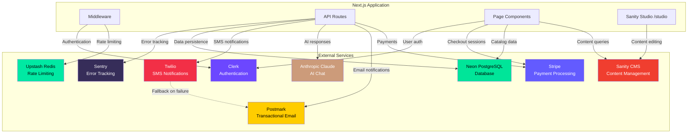

# External Service Integrations

This document provides a comprehensive overview of all external service integrations in the Muskingum Materials application, including their purpose, configuration, graceful degradation strategies, and Content Security Policy (CSP) requirements.

## Table of Contents

1. [Stripe](#1-stripe---payment-processing)
2. [Clerk](#2-clerk---authentication)
3. [Sanity](#3-sanity---content-management-system)
4. [Postmark](#4-postmark---transactional-email)
5. [Twilio](#5-twilio---sms-notifications)
6. [Anthropic](#6-anthropic---ai-chat)
7. [Upstash](#7-upstash---redis-rate-limiting)
8. [Neon](#8-neon---postgresql-database)
9. [Sentry](#9-sentry---error-tracking-and-monitoring)
10. [Integration Architecture](#integration-architecture)
11. [CSP Configuration Summary](#csp-configuration-summary)

---

## 1. Stripe - Payment Processing

### Purpose
Stripe powers the complete payment flow for online orders, including checkout session creation, payment processing, and webhook fulfillment.

### Environment Variables

| Variable | Required | Description |
|----------|----------|-------------|
| `STRIPE_SECRET_KEY` | **Production** | Server-side Stripe API key for payment processing |
| `NEXT_PUBLIC_STRIPE_PUBLISHABLE_KEY` | **Production** | Client-side Stripe key for Checkout sessions |
| `STRIPE_WEBHOOK_SECRET` | **Production** | Webhook signing secret for secure event verification |

### Integration Points

#### Checkout Session Creation
**File:** `app/api/orders/checkout/route.ts`

- Creates Stripe Checkout sessions with server-validated line items
- Never trusts client-supplied prices (see `lib/validate-checkout-prices.ts`)
- Passes order metadata (`orderNumber`) for webhook correlation
- Configures success/cancel URLs

#### Webhook Fulfillment
**File:** `app/api/orders/webhook/route.ts`

Handles `checkout.session.completed` events:
- Updates order status to `confirmed` and payment status to `paid`
- Retrieves Stripe receipt URL from payment intent
- Awards loyalty points for authenticated customers
- Triggers SMS confirmation if customer opted in
- All operations wrapped in Sentry breadcrumbs for debugging

#### Price Validation Trust Boundary
**File:** `lib/validate-checkout-prices.ts`

Critical security layer that:
- Re-fetches product prices from Prisma database
- Validates client-supplied quantities and items
- Prevents price manipulation attacks
- Calculates tax and total server-side

### Graceful Degradation

**Behavior when `STRIPE_SECRET_KEY` is missing:**
- Checkout API returns `501 Not Implemented` with clear error message
- Product catalog remains accessible
- Users can still request quotes via contact form
- No payment buttons displayed on frontend (conditional rendering)

**Production Requirements:**
- All three Stripe environment variables are **required** in production
- Webhook endpoint must be registered in Stripe Dashboard
- Webhook signing secret must match configured endpoint

### CSP Requirements

**Required in `next.config.ts`:**

```typescript
"script-src": "https://js.stripe.com https://*.stripe.com"
"script-src-elem": "https://js.stripe.com https://*.stripe.com"
"connect-src": "https://api.stripe.com https://*.stripe.com"
"frame-src": "https://js.stripe.com https://*.stripe.com"
```

**Why:** Stripe Checkout loads iframes and scripts from multiple Stripe domains for payment form rendering and tokenization.

### Configuration Notes

1. **Webhook Endpoint:** Register `https://yourdomain.com/api/orders/webhook` in Stripe Dashboard → Developers → Webhooks
2. **Webhook Events:** Subscribe to `checkout.session.completed`
3. **API Version:** Uses latest Stripe SDK (imported dynamically to avoid bundling in API routes)
4. **Receipt URLs:** Expanded from `payment_intent.latest_charge` for customer records

---

## 2. Clerk - Authentication

### Purpose
Clerk provides authentication with support for Google, GitHub, Apple, and Facebook SSO, as well as email/password and magic links.

### Environment Variables

| Variable | Required | Description |
|----------|----------|-------------|
| `NEXT_PUBLIC_CLERK_PUBLISHABLE_KEY` | **Production** | Client-side Clerk publishable key |
| `CLERK_SECRET_KEY` | **Production** | Server-side Clerk secret key for API calls |
| `NEXT_PUBLIC_CLERK_SIGN_IN_URL` | Optional | Custom sign-in page URL (default: `/sign-in`) |
| `NEXT_PUBLIC_CLERK_SIGN_UP_URL` | Optional | Custom sign-up page URL (default: `/sign-up`) |
| `NEXT_PUBLIC_CLERK_AFTER_SIGN_IN_URL` | Optional | Redirect after sign-in (default: `/account`) |
| `NEXT_PUBLIC_CLERK_AFTER_SIGN_UP_URL` | Optional | Redirect after sign-up (default: `/account`) |

### Integration Points

#### Middleware Authentication
**File:** `middleware.ts`

```typescript
const hasClerk = Boolean(
  process.env.NEXT_PUBLIC_CLERK_PUBLISHABLE_KEY &&
  process.env.NEXT_PUBLIC_CLERK_PUBLISHABLE_KEY !== "your_clerk_publishable_key"
);

if (hasClerk) {
  const { clerkMiddleware } = await import("@clerk/nextjs/server");
  const handler = clerkMiddleware();
  return await handler(request, {} as never);
}
```

- Dynamically imports Clerk only when configured (prevents build failures)
- Runs on every non-static request (excludes `_next`, `images`, `videos`, `favicon.ico`, `studio`)
- Executes **after** rate limiting in the middleware chain

#### Protected Routes
**File:** `app/account/layout.tsx` and all `/account/*` routes

Uses Clerk's `auth()` helper to enforce authentication:
- Redirects unauthenticated users to `/sign-in`
- Provides `userId` for database queries
- Manages session state across route changes

#### User Profile Integration
**File:** `lib/prisma.ts` (via Clerk webhooks or user creation)

- Clerk user ID stored in `UserProfile.userId`
- Links to `Order`, `LoyaltyAccount`, `Address`, and other user-scoped models
- Supports both authenticated and guest checkout (orders without `userId`)

### Graceful Degradation

**Behavior when `NEXT_PUBLIC_CLERK_PUBLISHABLE_KEY` is missing or placeholder:**
- Middleware skips Clerk entirely (no auth checks)
- `ClerkProvider` in `app/layout.tsx` renders but does nothing
- Authentication-gated routes remain accessible (dev/preview environments only)
- All SSO buttons hidden on frontend

**Production Requirements:**
- Both `NEXT_PUBLIC_CLERK_PUBLISHABLE_KEY` and `CLERK_SECRET_KEY` are **required**
- Clerk application must be configured in Clerk Dashboard
- Allowed redirect URLs must include production domain

### CSP Requirements

**Required in `next.config.ts`:**

```typescript
"script-src": "https://*.clerk.accounts.dev https://clerk.com"
"script-src-elem": "https://*.clerk.accounts.dev https://clerk.com"
"connect-src": "https://*.clerk.accounts.dev https://clerk.com https://clerk-telemetry.com"
"frame-src": "https://*.clerk.accounts.dev"
"img-src": "https://avatars.githubusercontent.com" // For GitHub SSO avatars
```

**Why:** Clerk uses iframes for authentication flows, loads scripts from CDN, and sends telemetry to monitoring endpoints.

### Configuration Notes

1. **SSO Providers:** Configured in Clerk Dashboard → User & Authentication → Social Connections
2. **Session Duration:** Default 7 days; configurable in Clerk Dashboard
3. **Multi-Factor Auth:** Optional; enable in Clerk Dashboard → Security
4. **Webhooks:** Can sync user events to Prisma (not currently implemented)

---

## 3. Sanity - Content Management System

### Purpose
Sanity Studio provides a headless CMS for marketing content, embedded at `/studio`. It holds testimonials, FAQs, gallery images, blog posts, site settings (singleton), and marketing-focused product/service descriptions.

**Important:** Prisma is the sole runtime catalog authority for products and services. Sanity hosts only marketing content: testimonials, FAQs, gallery images, blog posts, and site settings.

### Environment Variables

| Variable | Required | Description |
|----------|----------|-------------|
| `NEXT_PUBLIC_SANITY_PROJECT_ID` | Yes | Sanity project ID |
| `NEXT_PUBLIC_SANITY_DATASET` | Yes | Sanity dataset name (e.g., `production`) |
| `SANITY_API_TOKEN` | **Production** | Read token for draft/preview content |

### Integration Points

#### Sanity Client
**File:** `lib/sanity/client.ts`

- Exports `sanityClient` (CDN-cached, public content) and `previewClient` (draft content)
- Uses **placeholder fallback** when env vars are missing (prevents build crashes in Vercel preview deploys)
- Returns `undefined` from `fetch()` when using placeholder config; callers treat this as "fall back to static data"

#### Schemas
**Directory:** `sanity/schemaTypes/`

- **7 schemas:** `service`, `testimonial`, `faq`, `galleryImage`, `page`, `post`, `siteSettings`
- `siteSettings` is a singleton (enforced in `sanity.config.ts`)
- All schemas include metadata fields (`createdAt`, `updatedAt`, `publishedAt`)

#### GROQ Queries
**File:** `lib/sanity/queries.ts`

Defines reusable GROQ queries for:
- Fetching testimonials with author details
- Gallery images with hotspot cropping
- FAQs ordered by category
- Site settings (logo, contact info, social links)

#### Embedded Studio
**File:** `app/studio/[[...tool]]/page.tsx`

- Catch-all route at `/studio` renders Sanity Studio
- Configured in `sanity.config.ts` with custom schemas
- Singleton document filtering (only one `siteSettings` allowed)
- Limits actions to `publish`, `discardChanges`, `restore` (no unpublish or delete for siteSettings)

#### Visual Editing
**File:** `lib/sanity/client.ts` (stega enabled)

- `stega: { studioUrl: "/studio" }` enables in-Studio previews
- CDN image URLs include hotspot/crop parameters for responsive images

### Graceful Degradation

**Behavior when `NEXT_PUBLIC_SANITY_PROJECT_ID` is missing or `"placeholder"`:**
- `createStubClient()` returns a Proxy that resolves all methods to `undefined`
- No HTTP calls to Sanity API (prevents "Dataset not found" errors)
- Pages render with static fallback content
- Testimonials, FAQs, gallery images show empty states or hardcoded defaults

**Production Requirements:**
- All three Sanity env vars are **required** in production
- Dataset must exist in Sanity project
- API token must have read permissions

### CSP Requirements

**Required in `next.config.ts`:**

```typescript
"script-src": "https://core.sanity-cdn.com"
"script-src-elem": "https://core.sanity-cdn.com"
"connect-src": "https://cdn.sanity.io https://*.sanity.io wss://*.api.sanity.io https://*.apicdn.sanity.io https://sanity-cdn.com https://*.sanity-cdn.com"
"frame-src": "https://*.sanity.io https://*.sanity-cdn.com https://*.sanity.work"
"frame-ancestors": "https://*.sanity.io https://*.sanity.work https://*.sanity.build"
"img-src": "https://cdn.sanity.io"
```

**Why:**
- Studio loads iframes and scripts from multiple Sanity domains
- WebSocket connection (`wss://`) for real-time collaboration
- CDN images served from `cdn.sanity.io`
- `frame-ancestors` allows Studio to be embedded for visual editing

### Configuration Notes

1. **Two-Store Architecture:** See `CLAUDE.md` → "Two parallel content stores". Prisma is the runtime source of truth for products/services; Sanity holds marketing copy.
2. **Image Hotspots:** Use Sanity's image crop/hotspot UI for responsive images
3. **Singleton Enforcement:** `siteSettings` is limited to one document via custom document actions
4. **Revalidation:** Use `/api/revalidate` webhook to bust Next.js cache on publish

---

## 4. Postmark - Transactional Email

### Purpose
Postmark sends transactional emails for order confirmations, quote notifications, contact form submissions, and newsletter campaigns.

### Environment Variables

| Variable | Required | Description |
|----------|----------|-------------|
| `POSTMARK_API_TOKEN` | Optional | Postmark server API token |
| `POSTMARK_FROM_EMAIL` | Optional | Sender email address (default: `noreply@muskingummaterials.com`) |

### Integration Points

#### Email Utility
**File:** `lib/email.ts`

```typescript
export async function sendEmail({
  to,
  subject,
  textBody,
  htmlBody,
  replyTo,
}: SendEmailParams): Promise<boolean>
```

- Returns `false` if `POSTMARK_API_TOKEN` is missing (graceful degradation)
- Dynamically imports `postmark` package to avoid bundling in edge runtime
- Logs errors to `lib/logger.ts` with recipient and subject context

#### Email Fallback for SMS
**File:** `lib/sms.ts` → `sendEmailFallback()`

When Twilio SMS fails and an email address is provided:
- Falls back to Postmark for order updates
- Uses same `POSTMARK_API_TOKEN` configuration
- Logs both SMS failure and email fallback attempts

#### Order Notifications
**File:** `lib/email/order-notifications.ts`

Sends:
- Order confirmation emails after Stripe webhook
- Quote request confirmations
- Contact form submissions to admin

### Graceful Degradation

**Behavior when `POSTMARK_API_TOKEN` is missing:**
- `sendEmail()` returns `false` immediately (no-op)
- Callers log warning but do not fail the request
- Order processing continues without email (SMS may still work)
- Admin notifications not sent (manual follow-up required)

**Production Requirements:**
- `POSTMARK_API_TOKEN` is **strongly recommended** but technically optional
- Sender domain must be verified in Postmark Dashboard
- DKIM/SPF records configured for deliverability

### CSP Requirements

**None required.** Postmark is a server-side API; no client-side scripts or resources.

### Configuration Notes

1. **Templates:** Use Postmark's template system for consistent branding (not currently implemented; emails are plain text + HTML)
2. **Bounce Handling:** Configure webhook in Postmark Dashboard → Servers → Webhooks → Bounce
3. **Rate Limits:** Postmark free tier: 100 emails/month; paid tiers have higher limits
4. **From Address:** Must match verified domain in Postmark

---

## 5. Twilio - SMS Notifications

### Purpose
Twilio sends SMS notifications for order confirmations and status updates. Supports opt-in tracking and STOP webhook for compliance.

### Environment Variables

| Variable | Required | Description |
|----------|----------|-------------|
| `TWILIO_ACCOUNT_SID` | Optional | Twilio account SID |
| `TWILIO_AUTH_TOKEN` | Optional | Twilio auth token |
| `TWILIO_PHONE_NUMBER` | Optional | Twilio sender phone number (E.164 format) |

### Integration Points

#### SMS Service
**File:** `lib/sms.ts`

```typescript
export async function sendSMS(params: SendSMSParams): Promise<SendSMSResult>
```

- Checks for all three Twilio env vars; logs error if any are missing
- Falls back to Postmark email if SMS fails **and** an email address is provided
- Returns `{ success: boolean, messageId?: string, error?: string }`

#### Order Status Messages
**File:** `lib/sms.ts` → `getOrderStatusMessage()`

Generates formatted messages for:
- `confirmed`: "Your order [ID] has been confirmed and is being prepared."
- `shipped`: "Your order [ID] has been shipped and is on its way!"
- `delivered`: "Your order [ID] has been delivered. Thank you for your purchase!"
- `cancelled`: "Your order [ID] has been cancelled."

#### Opt-In Tracking
**Model:** `Order.smsOptIn` (boolean field in Prisma schema)

- Checkbox in checkout form
- SMS only sent if `smsOptIn === true`
- Tracked per-order (not per-user)

#### STOP Webhook
**File:** `app/api/sms/webhook/route.ts`

Handles Twilio inbound message webhooks:
- Detects "STOP", "UNSUBSCRIBE", "QUIT" keywords
- Marks `Order.smsOptIn = false` for matching phone numbers
- Returns TwiML response for compliance

### Graceful Degradation

**Behavior when Twilio env vars are missing:**
- `sendSMS()` logs error and attempts email fallback
- If email fallback also fails (no Postmark), returns `{ success: false }`
- Order processing continues without notifications
- Admin sees failed notification in logs

**Email Fallback:**
- Triggered when SMS fails **and** `email` param is provided
- Uses Postmark API (`lib/email.ts`)
- Logs both SMS failure and fallback attempt to Sentry

**Production Requirements:**
- All three Twilio env vars are **strongly recommended** but optional
- Phone number must be verified in Twilio Dashboard
- STOP webhook must be registered for compliance

### CSP Requirements

**None required.** Twilio is a server-side API; no client-side scripts or resources.

### Configuration Notes

1. **Phone Number Format:** Must be E.164 format (e.g., `+17401234567`)
2. **Webhook Configuration:** Register `https://yourdomain.com/api/sms/webhook` in Twilio Console → Phone Numbers → Messaging Configuration
3. **STOP Compliance:** Required by TCPA; webhook handles automatic opt-out
4. **Cost Tracking:** See `app/api/admin/sms-costs/route.ts` for usage reporting

---

## 6. Anthropic - AI Chat

### Purpose
Powers the AI chat widget using Claude Haiku 4.5 via Vercel AI SDK. Provides product information, hours, pricing, and general customer service.

### Environment Variables

| Variable | Required | Description |
|----------|----------|-------------|
| `ANTHROPIC_API_KEY` | Optional | Anthropic API key for Claude models |

### Integration Points

#### Chat API Route
**File:** `app/api/chat/route.ts`

```typescript
if (process.env.ANTHROPIC_API_KEY) {
  const result = await generateText({
    model: anthropic("claude-haiku-4-5-20251001"),
    system: systemPrompt,
    messages,
    maxOutputTokens: 500,
  });
  reply = result.text;
} else {
  reply = await getStaticResponse(data.message);
}
```

- Uses Vercel AI SDK's `generateText()` with `@ai-sdk/anthropic`
- System prompt built at request time from `data/business.ts` and live Prisma catalog
- Falls back to `getStaticResponse()` if API key is missing
- Conversations persisted to `ChatConversation` and `ChatMessage` models (best-effort)

#### Static Response Fallback
**File:** `app/api/chat/route.ts` → `getStaticResponse()`

Keyword-matched responses for:
- Pricing queries → fetches top 5 products from Prisma
- Hours/location → returns hardcoded business info
- Delivery → explains delivery service
- Payment → lists accepted payment methods

Ensures chat widget remains functional even without Claude API.

#### System Prompt Construction
**File:** `app/api/chat/route.ts` → `buildSystemPrompt()`

Dynamically builds prompt with:
- Business info from `data/business.ts` (`BUSINESS_INFO`, `PRODUCTS`, `SERVICES`)
- Live product catalog from Prisma (`Product.findMany({ active: true })`)
- Live service catalog from Prisma (`Service.findMany({ active: true })`)
- Guidelines for tone, accuracy, and brevity

**Note:** `data/business.ts` is the canonical source for hardcoded business info in prompts, not the Prisma `Product` table.

### Graceful Degradation

**Behavior when `ANTHROPIC_API_KEY` is missing:**
- Falls back to `getStaticResponse()` with keyword matching
- Pricing queries still show live data from Prisma
- Chat widget remains functional (no error to user)
- Responses are less intelligent but accurate for common questions

**Production Requirements:**
- `ANTHROPIC_API_KEY` is **strongly recommended** but technically optional
- Without it, chat falls back to static keyword matching
- No degradation in product catalog accuracy (Prisma-sourced)

### CSP Requirements

**None required.** Anthropic API is server-side; no client-side scripts or resources.

### Configuration Notes

1. **Model:** Uses `claude-haiku-4-5-20251001` for speed and cost efficiency
2. **Token Limit:** `maxOutputTokens: 500` prevents long-winded responses
3. **Rate Limiting:** Chat endpoint has dedicated tier: 5 requests/minute (see `lib/rate-limit.ts`)
4. **Conversation Persistence:** Stored in Prisma; DB failures don't fail the chat request
5. **History Limit:** Client sends last 50 messages max (enforced by Zod schema)

---

## 7. Upstash - Redis Rate Limiting

### Purpose
Provides distributed rate limiting via Redis for public API endpoints. Falls back to in-memory rate limiting when Redis is unavailable.

### Environment Variables

| Variable | Required | Description |
|----------|----------|-------------|
| `UPSTASH_REDIS_REST_URL` | Optional | Upstash Redis REST URL |
| `UPSTASH_REDIS_REST_TOKEN` | Optional | Upstash Redis REST token |

### Integration Points

#### Rate Limit Utility
**File:** `lib/rate-limit.ts`

Three tiers defined:
- `chat`: 5 requests / minute (`/api/chat`)
- `contact-quote`: 10 requests / hour (`/api/contact`, `/api/quote`, `/api/orders/checkout`)
- `leads-newsletter`: 20 requests / hour (`/api/leads`, `/api/newsletter`)

**Redis Implementation:**
```typescript
const redis = (process.env.UPSTASH_REDIS_REST_URL && process.env.UPSTASH_REDIS_REST_TOKEN)
  ? new Redis({ url: ..., token: ... })
  : null;

const chatLimiter = redis
  ? new Ratelimit({
      redis,
      limiter: Ratelimit.slidingWindow(5, "1 m"),
      analytics: true,
      prefix: "@ratelimit/chat",
    })
  : null;
```

**In-Memory Fallback:**
- When `redis === null`, uses `InMemoryStore` class
- `Map<string, { count: number, reset: number }>` with 60-second cleanup interval
- Not shared across serverless invocations (each instance has its own limits)

#### Middleware Integration
**File:** `middleware.ts`

```typescript
const rateLimitedEndpoints: Record<string, RateLimitTier> = {
  "/api/chat": "chat",
  "/api/contact": "contact-quote",
  "/api/quote": "contact-quote",
  "/api/orders/checkout": "contact-quote",
  "/api/leads": "leads-newsletter",
  "/api/newsletter": "leads-newsletter",
};

const identifier = getClientIdentifier(request);
const result = await checkRateLimit(identifier, rateLimitTier);
```

- Runs **before** Clerk auth in middleware chain
- Returns `429 Too Many Requests` with `Retry-After` and `X-RateLimit-*` headers
- Logs to Sentry with hashed identifier (FNV-1a) to avoid PII

#### Client Identifier
**File:** `lib/rate-limit.ts` → `getClientIdentifier()`

Priority order:
1. `x-forwarded-for` header (first IP in list)
2. `x-real-ip` header
3. Fallback: `"unknown"` (rate limiting **skipped** for "unknown" to prevent shared bucket abuse)

### Graceful Degradation

**Behavior when Upstash env vars are missing:**
- Falls back to in-memory `Map` store
- Rate limits apply **per serverless instance**, not globally
- Effective in low-traffic scenarios or single-server deployments
- Not recommended for production (easy to bypass with multiple IPs)

**Behavior when Redis request fails:**
- Try/catch around `limiter.limit(identifier)` catches Redis errors
- Falls back to in-memory store for that request
- Logged as warning (not error)

**Production Requirements:**
- Both `UPSTASH_REDIS_REST_URL` and `UPSTASH_REDIS_REST_TOKEN` are **strongly recommended**
- Without Redis, rate limiting is per-instance (not globally effective)
- In-memory fallback acceptable for preview/staging environments

### CSP Requirements

**None required.** Upstash Redis is a server-side API; no client-side scripts or resources.

### Configuration Notes

1. **Sliding Window:** Uses `Ratelimit.slidingWindow()` for smooth rate enforcement (better than fixed window)
2. **Analytics:** `analytics: true` enables Upstash Analytics dashboard
3. **Cleanup:** In-memory store runs `cleanup()` every 60 seconds to remove expired entries
4. **Unknown Identifier Handling:** Middleware skips rate limiting when `identifier === "unknown"` to prevent shared bucket abuse
5. **Adding New Endpoints:** Register in `rateLimitedEndpoints` map in `middleware.ts`

---

## 8. Neon - PostgreSQL Database

### Purpose
Neon provides the production PostgreSQL database for all transactional data. Prisma ORM manages schema, migrations, and queries.

### Environment Variables

| Variable | Required | Description |
|----------|----------|-------------|
| `DATABASE_URL` | **Yes** | Neon connection string (PostgreSQL URI) |
| `DIRECT_URL` | **Yes** | Direct connection string for migrations (bypasses pooling) |

### Integration Points

#### Prisma Client
**File:** `lib/prisma.ts`

Singleton `PrismaClient` instance:
```typescript
export const prisma = globalThis.prisma || new PrismaClient();
if (process.env.NODE_ENV !== 'production') {
  globalThis.prisma = prisma;
}
```

- Global instance in dev prevents multiple clients during hot reload
- Fresh instance in production (stateless serverless functions)

#### Schema
**File:** `prisma/schema.prisma`

**23 models:**
- **Products/Services:** `Product`, `Service`, `CostGuide`, `ProductComparison`
- **Orders:** `Order`, `OrderItem`, `SavedOrder`, `RecurringOrder`
- **Customers:** `Lead`, `ContactSubmission`, `QuoteRequest`, `NewsletterSubscriber`
- **Accounts:** `UserProfile`, `Address`, `LoyaltyAccount`, `LoyaltyTransaction`, `PointRedemption`
- **Communication:** `ChatConversation`, `ChatMessage`
- **Admin:** `EmailCampaign`, `ReviewRequest`
- **System:** `ApiKey`, `OutOfStockNotification`

#### Commands
**File:** `package.json` scripts

```bash
npm run db:push      # Push schema to Neon (uses dotenv-cli for .env.local)
npm run db:studio    # Open Prisma Studio
npm run db:seed      # Run prisma/seed.ts
```

**Important:** `postinstall` runs `prisma generate`, so a fresh `npm install` produces a usable client.

#### Seed Script
**File:** `prisma/seed.ts`

Populates initial data:
- Products (sand, gravel, topsoil, etc.)
- Services (delivery, grading, excavation)
- Cost guides

Run via `npm run db:seed` (uses `tsx` and `dotenv -e .env.local --`)

### Graceful Degradation

**Behavior when `DATABASE_URL` is invalid or Neon is unreachable:**
- Prisma queries throw errors (no built-in fallback)
- API routes catch errors and return `500 Internal Server Error`
- Chat API falls back to static responses if catalog fetch fails
- No automatic retry (implement at call site if needed)

**Production Requirements:**
- Both `DATABASE_URL` and `DIRECT_URL` are **required**
- Connection pooling enabled in `DATABASE_URL` (via Neon Serverless Driver)
- `DIRECT_URL` used for migrations (bypasses pooling)

### CSP Requirements

**None required.** Neon is a server-side database; no client-side scripts or resources.

### Configuration Notes

1. **Connection Pooling:** Neon automatically provides pooling via Serverless Driver; use pooled URL for `DATABASE_URL`
2. **Migrations:** Use `DIRECT_URL` for `npx prisma migrate deploy` to avoid pooling issues
3. **Branching:** Neon supports database branching for preview deploys (not currently implemented)
4. **Autoscaling:** Neon automatically scales storage and compute
5. **Env Loading:** Scripts use `dotenv -e .env.local --` because Prisma CLI doesn't auto-load `.env.local`

---

## 9. Sentry - Error Tracking and Monitoring

### Purpose
Sentry provides production error tracking, performance monitoring, session replay, and alerting for payment failures, database errors, and rate limit violations.

### Environment Variables

| Variable | Required | Description |
|----------|----------|-------------|
| `NEXT_PUBLIC_SENTRY_DSN` | **Production** | Sentry Data Source Name (public key) |
| `SENTRY_ENABLED` | Optional | Set to `"true"` to enable in development |

### Integration Points

#### Monitoring Library
**File:** `lib/monitoring.ts`

```typescript
export function initMonitoring(): void {
  if (!process.env.NEXT_PUBLIC_SENTRY_DSN) {
    if (isProduction) {
      console.warn('NEXT_PUBLIC_SENTRY_DSN not set - monitoring disabled');
    }
    return;
  }

  Sentry.init({
    dsn: process.env.NEXT_PUBLIC_SENTRY_DSN,
    environment: process.env.NODE_ENV || 'development',
    tracesSampleRate: isProduction ? 0.1 : 1.0,
    replaysSessionSampleRate: isProduction ? 0.1 : 0,
    replaysOnErrorSampleRate: 1.0,
    enabled: isProduction || process.env.SENTRY_ENABLED === 'true',
  });
}
```

**Utility Functions:**
- `captureError(error, context)` - General error capture
- `captureWarning(message, context)` - Warning-level events
- `capturePaymentFailure(error, context)` - Tagged for Stripe failures
- `captureDatabaseError(error, context)` - Tagged for Prisma failures
- `captureRateLimitWarning(message, context)` - Tagged for rate limit events
- `setUser(userId)` - Associate errors with authenticated users
- `addBreadcrumb(message, category, data)` - Debugging trail
- `startTransaction(name, operation, callback)` - Performance spans

#### Logger Integration
**File:** `lib/logger.ts`

```typescript
if (error) {
  addBreadcrumb(message, 'error', metadata);
  if (process.env.NODE_ENV === 'production') {
    captureError(error, metadata);
  }
}
```

- All `logger.error()` calls automatically create Sentry breadcrumbs
- Errors captured in production only (unless `SENTRY_ENABLED=true`)

#### Payment Failure Tracking
**File:** `app/api/orders/webhook/route.ts`

```typescript
addBreadcrumb("Stripe webhook received", "payment", {
  eventType: event.type,
  eventId: event.id,
});
```

Every Stripe webhook event creates a breadcrumb trail for debugging failed payments.

#### Alert Configuration
**Documented in:** `lib/monitoring.ts` (lines 236-323)

Three preconfigured alerts:
1. **Payment Failure Alert** - Immediate notification on `error_type: payment_failure`
2. **Database Connection Alert** - Throttled (1/min) on `error_type: database_connection`
3. **Rate Limit Threshold Alert** - Hourly digest on `warning_type: rate_limit_approaching`

**Dashboard Configuration:**
**Documented in:** `lib/monitoring.ts` (lines 325-521)

6 widgets for Production Monitoring dashboard:
1. Error Rate by Route (line chart, 7 days)
2. Response Time Percentiles (p50/p75/p95/p99, 7 days)
3. Payment Success/Failure Rate (big number + trend)
4. Rate Limit Violations (count + table by endpoint)
5. Overall Error Rate Trend (area chart, 7 days)
6. Database Error Rate (line chart, 7 days)

### Graceful Degradation

**Behavior when `NEXT_PUBLIC_SENTRY_DSN` is missing:**
- `initMonitoring()` logs warning and returns early
- All capture functions become no-ops (no-throw)
- Application continues normally without monitoring
- Console warnings visible in production logs

**Production Requirements:**
- `NEXT_PUBLIC_SENTRY_DSN` is **strongly recommended** but technically optional
- Without it, errors are logged to console only (ephemeral in serverless)
- No performance monitoring or session replay

### CSP Requirements

**None currently required.** Sentry SDK uses `fetch()` API, which is allowed by default `connect-src 'self'`.

If using Sentry's Session Replay or browser-side error tracking (not currently enabled), add:

```typescript
"script-src": "https://browser.sentry-cdn.com"
"connect-src": "https://*.sentry.io"
```

### Configuration Notes

1. **Sampling Rates:**
   - Production traces: 10% (`tracesSampleRate: 0.1`)
   - Production replays: 10% sessions, 100% errors (`replaysSessionSampleRate: 0.1`, `replaysOnErrorSampleRate: 1.0`)
   - Dev traces: 100% for debugging
2. **Sensitive Data Filtering:** `beforeSend()` removes `authorization` and `cookie` headers
3. **User Context:** Set via `setUser(userId)` after Clerk auth (not currently implemented)
4. **Breadcrumb Trail:** Every `logger.error()` call adds breadcrumb for debugging context
5. **PII Protection:** Client identifiers hashed (FNV-1a) before logging to Sentry

---

## Integration Architecture

### Service Integration Map



**Key Data Flows:**
- **Middleware** → Upstash (rate limiting checks), Clerk (authentication)
- **API Routes** → Stripe (payment processing), Postmark (emails), Anthropic (AI chat), Twilio (SMS), Neon (database), Sentry (error tracking)
- **Page Components** → Sanity (CMS content), Neon (product catalog), Stripe (checkout), Clerk (auth)
- **Sanity Studio** → Sanity (content editing)
- **Fallback** → Twilio → Postmark (SMS failures fall back to email)

### Service Dependency Graph

```
┌─────────────────────────────────────────────────────────────────┐
│                         Next.js Application                      │
│                                                                  │
│  ┌──────────────┐                                                │
│  │  Middleware  │                                                │
│  │  ───────────                                                  │
│  │  1. Upstash Rate Limiting ──────────────► [Upstash Redis]    │
│  │  2. Clerk Auth ──────────────────────────► [Clerk]           │
│  └──────────────┘                                                │
│                                                                  │
│  ┌──────────────────────────────────────────────────────────┐   │
│  │                    API Routes                             │   │
│  │  ─────────────                                            │   │
│  │  /api/chat ────────────────────────────► [Anthropic]     │   │
│  │           └─────────────────────────────► [Neon/Prisma]  │   │
│  │                                                            │   │
│  │  /api/orders/checkout ─────────────────► [Stripe]        │   │
│  │           └─────────────────────────────► [Neon/Prisma]  │   │
│  │                                                            │   │
│  │  /api/orders/webhook ──────────────────► [Stripe]        │   │
│  │           ├─────────────────────────────► [Neon/Prisma]  │   │
│  │           ├─────────────────────────────► [Twilio]       │   │
│  │           │    └─ Fallback to ──────────► [Postmark]     │   │
│  │           └─────────────────────────────► [Sentry]       │   │
│  │                                                            │   │
│  │  /api/contact ──────────────────────────► [Postmark]     │   │
│  │           └─────────────────────────────► [Neon/Prisma]  │   │
│  └──────────────────────────────────────────────────────────┘   │
│                                                                  │
│  ┌──────────────────────────────────────────────────────────┐   │
│  │                  Page Components                          │   │
│  │  ─────────────                                            │   │
│  │  Product Catalog ───────────────────────► [Neon/Prisma]  │   │
│  │  CMS Content ───────────────────────────► [Sanity]       │   │
│  │  Checkout ──────────────────────────────► [Stripe]       │   │
│  │  Auth Pages ────────────────────────────► [Clerk]        │   │
│  └──────────────────────────────────────────────────────────┘   │
│                                                                  │
│  ┌──────────────────────────────────────────────────────────┐   │
│  │                  Error Handling                           │   │
│  │  ─────────────                                            │   │
│  │  All try/catch blocks ──────────────────► [Sentry]       │   │
│  │  Logger errors ─────────────────────────► [Sentry]       │   │
│  └──────────────────────────────────────────────────────────┘   │
│                                                                  │
│  ┌──────────────────────────────────────────────────────────┐   │
│  │                  Embedded Studio                          │   │
│  │  ─────────────                                            │   │
│  │  /studio/** ────────────────────────────► [Sanity]       │   │
│  └──────────────────────────────────────────────────────────┘   │
└─────────────────────────────────────────────────────────────────┘
```

### Critical Paths

#### Checkout Flow
1. Client selects products → added to Zustand cart
2. Client submits checkout → `POST /api/orders/checkout`
3. **Server validates prices** → `lib/validate-checkout-prices.ts` (trust boundary)
4. Server creates Stripe Checkout session → `stripe.checkout.sessions.create()`
5. Client redirects to Stripe-hosted checkout
6. Customer completes payment
7. **Stripe webhook fires** → `POST /api/orders/webhook`
8. Server updates order status → Prisma
9. Server sends SMS confirmation → Twilio (fallback to Postmark)
10. Server awards loyalty points → Prisma

**Failure Points:**
- Stripe API down → Checkout unavailable, show error + phone number
- Prisma connection fails → Checkout fails (retry logic recommended)
- Twilio/Postmark down → Order processes but no notification sent

#### Chat Flow
1. Client sends message → `POST /api/chat`
2. Server checks rate limit → Upstash (fallback to in-memory)
3. Server builds system prompt → Fetches live catalog from Prisma
4. **Anthropic API available?**
   - Yes → `generateText()` with Claude
   - No → `getStaticResponse()` with keyword matching
5. Server persists conversation → Prisma (best-effort, failures ignored)
6. Server returns reply → Client displays in chat widget

**Failure Points:**
- Anthropic API down → Falls back to static responses (no user-facing error)
- Prisma connection fails → Chat continues, conversation not saved
- Upstash down → Falls back to in-memory rate limiting (per-instance)

---

## CSP Configuration Summary

**File:** `next.config.ts`

The following is the complete Content Security Policy configuration. **Any new third-party service requires updating this CSP** or it will be blocked silently in production.

```typescript
"default-src 'self'"
"script-src 'self' 'unsafe-eval' 'unsafe-inline' https://*.clerk.accounts.dev https://clerk.com https://js.stripe.com https://*.stripe.com https://core.sanity-cdn.com https://www.googletagmanager.com https://maps.googleapis.com https://maps.gstatic.com https://*.googleapis.com https://*.gstatic.com"
"script-src-elem 'self' 'unsafe-inline' https://*.clerk.accounts.dev https://clerk.com https://js.stripe.com https://*.stripe.com https://core.sanity-cdn.com https://www.googletagmanager.com https://maps.googleapis.com https://maps.gstatic.com https://*.googleapis.com https://*.gstatic.com"
"worker-src 'self' blob:"
"style-src 'self' 'unsafe-inline' https://fonts.googleapis.com"
"img-src 'self' data: blob: https://cdn.sanity.io https://lh3.googleusercontent.com https://images.unsplash.com https://avatars.githubusercontent.com https://source.unsplash.com https://www.googletagmanager.com https://www.google-analytics.com https://maps.googleapis.com https://maps.gstatic.com https://*.googleapis.com https://*.gstatic.com https://*.google.com https://streetviewpixels-pa.googleapis.com"
"font-src 'self' data: https://fonts.gstatic.com"
"connect-src 'self' https://*.clerk.accounts.dev https://clerk.com https://clerk-telemetry.com https://api.stripe.com https://*.stripe.com https://cdn.sanity.io https://*.sanity.io wss://*.api.sanity.io https://*.apicdn.sanity.io https://sanity-cdn.com https://*.sanity-cdn.com https://www.google-analytics.com https://maps.googleapis.com https://*.googleapis.com https://*.gstatic.com"
"frame-src 'self' https://*.clerk.accounts.dev https://js.stripe.com https://*.stripe.com https://*.sanity.io https://*.sanity-cdn.com https://*.sanity.work https://www.google.com"
"object-src 'none'"
"base-uri 'self'"
"form-action 'self'"
"frame-ancestors 'self' https://*.sanity.io https://*.sanity.work https://*.sanity.build"
"upgrade-insecure-requests"
```

### CSP Quick Reference by Service

| Service | CSP Directives Required |
|---------|-------------------------|
| **Stripe** | `script-src`, `script-src-elem`, `connect-src`, `frame-src` |
| **Clerk** | `script-src`, `script-src-elem`, `connect-src`, `frame-src`, `img-src` (GitHub avatars) |
| **Sanity** | `script-src`, `script-src-elem`, `connect-src`, `frame-src`, `frame-ancestors`, `img-src` |
| **Postmark** | None (server-side only) |
| **Twilio** | None (server-side only) |
| **Anthropic** | None (server-side only) |
| **Upstash** | None (server-side only) |
| **Neon** | None (server-side only) |
| **Sentry** | None (uses `fetch()` API) |
| **Google Maps** | `script-src`, `script-src-elem`, `connect-src`, `img-src` |
| **Google Analytics** | `script-src`, `script-src-elem`, `connect-src`, `img-src` |

### Adding a New Third-Party Service

1. **Identify required domains** - Check service documentation for script/iframe/API domains
2. **Update `next.config.ts`** - Add domains to appropriate CSP directives
3. **Test in production build** - CSP violations only appear in prod mode (`npm run build && npm start`)
4. **Monitor browser console** - CSP violations logged as errors with blocked resource URL
5. **Update this document** - Add new service section with CSP requirements

---

## Production Checklist

### Required for Production

- [ ] **Stripe:** All 3 env vars set, webhook registered
- [ ] **Clerk:** Both env vars set, SSO providers configured, redirect URLs whitelisted
- [ ] **Sanity:** All 3 env vars set, dataset exists, API token has read permissions
- [ ] **Neon:** Both `DATABASE_URL` and `DIRECT_URL` set, schema pushed

### Strongly Recommended

- [ ] **Postmark:** API token set, sender domain verified (DKIM/SPF configured)
- [ ] **Twilio:** All 3 env vars set, phone number verified, STOP webhook registered
- [ ] **Anthropic:** API key set (otherwise falls back to static chat responses)
- [ ] **Upstash:** Both env vars set (otherwise per-instance rate limiting)
- [ ] **Sentry:** DSN set, alerts configured, dashboard created

### Testing Graceful Degradation

Before deploying, test each service's fallback behavior:

1. **Remove Stripe env vars** → Checkout should show clear error message
2. **Remove Clerk env vars** → Auth pages should be hidden, account routes accessible (dev only)
3. **Remove Sanity env vars** → Pages should render with empty states, no build crashes
4. **Remove Postmark env var** → Emails should log error but not fail request
5. **Remove Twilio env vars** → SMS should fall back to email (if available)
6. **Remove Anthropic env var** → Chat should use keyword-matched static responses
7. **Remove Upstash env vars** → Rate limiting should use in-memory fallback
8. **Remove Sentry DSN** → Errors should log to console only

### Security Notes

1. **Never commit real env vars** - Use `.env.local` (gitignored)
2. **Rotate API keys annually** - All services support key rotation
3. **Use separate keys per environment** - Dev/staging/production should have distinct keys
4. **Monitor webhook secrets** - Stripe/Twilio webhooks validate signatures
5. **CSP violations are silent** - Test in production mode before deploy

---

## Related Documentation

- [Architecture README](./README.md) - Overview of all architecture docs
- [Authentication](./authentication.md) - Clerk integration details
- [Chat System](./chat-system.md) - Anthropic integration details
- [CMS Integration](./cms-integration.md) - Sanity integration details
- [Database Schema](./database-schema.md) - Prisma models and Neon setup
- [Order Flow](./order-flow.md) - Stripe checkout and webhook flow
- [CLAUDE.md](../../CLAUDE.md) - Project conventions and graceful degradation patterns

---

**Last Updated:** 2026-05-23  
**Maintained By:** Engineering Team
