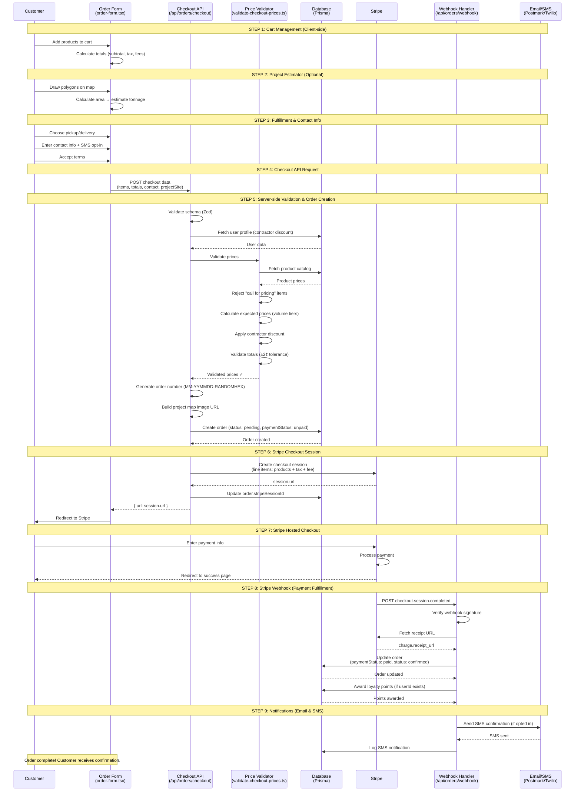

# Order Flow Documentation

## TL;DR

The order flow spans **4 main files** and **9 steps** from cart creation to delivery confirmation. It integrates **Stripe** for payments, **Prisma** for database persistence, **Postmark** for email notifications, and **Twilio** for SMS confirmations. The flow enforces **server-side price validation** (never trusting client-supplied prices), generates unique order numbers, and supports both Stripe checkout and fallback pay-on-pickup/delivery.

**Critical files:**
- `components/order/order-form.tsx` — Multi-step order form with cart management
- `app/api/orders/checkout/route.ts` — Checkout API with price validation and Stripe session creation
- `lib/validate-checkout-prices.ts` — **Trust boundary** for server-side price verification
- `app/api/orders/webhook/route.ts` — Stripe webhook handler for payment fulfillment
- `lib/email-service.ts` — Email notifications via Postmark
- `lib/sms.ts` — SMS notifications via Twilio

---

## Order Flow Sequence

### End-to-End Flow Diagram



### Detailed Flow Breakdown

```
┌─────────────────────────────────────────────────────────────────────────────┐
│                           ORDER FLOW (9 STEPS)                              │
└─────────────────────────────────────────────────────────────────────────────┘

1. CART MANAGEMENT (Client-side)
   └─► components/order/order-form.tsx
         ├─► Zustand store (lib/store.ts) manages cart state
         ├─► User adds products, adjusts quantities
         └─► Cart totals calculated client-side (subtotal, tax, fees)

2. PROJECT ESTIMATOR (Optional)
   └─► components/order/project-estimator.tsx
         ├─► Google Maps satellite view
         ├─► User draws polygons to define project area
         ├─► Calculates area (sq ft) → estimates tonnage
         └─► Stored as projectSite data in form state

3. FULFILLMENT & CONTACT INFO
   └─► components/order/order-form.tsx
         ├─► User chooses: pickup | delivery
         ├─► If delivery: requires address
         ├─► Contact info: name, email, phone
         ├─► SMS opt-in checkbox
         └─► Terms acceptance (required)

4. CHECKOUT API REQUEST
   └─► POST /api/orders/checkout
         │
         ├─► Request body:
         │     {
         │       name, email, phone,
         │       fulfillment: 'pickup' | 'delivery',
         │       deliveryAddress, deliveryNotes,
         │       smsOptIn, termsAccepted,
         │       items: [{ name, price, unit, quantity }],
         │       subtotal, tax, processingFee, total,
         │       projectSite: { address, location, polygons, estimate }
         │     }
         │
         └─► Headers:
               Content-Type: application/json

5. SERVER-SIDE VALIDATION & ORDER CREATION
   └─► app/api/orders/checkout/route.ts
         │
         ├─► [A] Zod validation (checkoutSchema)
         │       └─► Validates all fields, ensures termsAccepted === true
         │
         ├─► [B] Fetch authenticated user (if logged in)
         │       └─► Clerk auth() → userId
         │       └─► Fetch contractor discount from UserProfile
         │
         ├─► [C] ★ SERVER-SIDE PRICE VALIDATION ★
         │       └─► lib/validate-checkout-prices.ts
         │             ├─► Fetch product prices from Prisma (or Sanity fallback)
         │             ├─► Reject "call for pricing" items
         │             ├─► Calculate expected price per item (with volume tiers)
         │             ├─► Apply contractor discount if applicable
         │             ├─► Validate client prices match catalog (±1¢ tolerance)
         │             ├─► Recalculate subtotal, tax (7.25%), processing fee (4.5%)
         │             └─► Validate claimed totals match recalculated (±2¢ tolerance)
         │
         ├─► [D] Generate unique order number
         │       └─► Format: MM-YYMMDD-RANDOMHEX
         │       └─► Example: MM-260523-A7F3E2B1
         │
         ├─► [E] Build project map image URL (if projectSite exists)
         │       └─► lib/static-map.ts
         │             └─► Google Static Maps API with satellite view
         │             └─► Renders polygons + center pin
         │
         ├─► [F] Create Order in database
         │       └─► prisma.order.create({
         │             orderNumber,
         │             userId (nullable),
         │             name, email, phone,
         │             items (JSON),
         │             subtotal, tax, processingFee, total,
         │             pickupOrDeliver,
         │             deliveryAddress, deliveryNotes,
         │             smsOptIn,
         │             termsAcceptedAt,
         │             status: "pending",
         │             paymentStatus: "unpaid",
         │             projectAddress, projectLat, projectLng,
         │             projectAreaSqFt, projectDepthInches,
         │             projectEstimateTons, projectEstimateCubicYards,
         │             projectEstimateSource,
         │             projectPolygons (JSON),
         │             projectMapImageUrl
         │           })
         │
         └─► [G] Branch: Stripe vs. No-Stripe flow
               │
               ├─► IF STRIPE_SECRET_KEY exists:
               │     │
               │     ├─► Create Stripe Checkout session
               │     │     └─► stripe.checkout.sessions.create({
               │     │           payment_method_types: ["card"],
               │     │           line_items: [
               │     │             ...products,
               │     │             { tax line },
               │     │             { processing fee line }
               │     │           ],
               │     │           mode: "payment",
               │     │           success_url: /order/success?order={orderNumber},
               │     │           cancel_url: /order?canceled=true,
               │     │           metadata: { orderNumber, customerName, ... }
               │     │         })
               │     │
               │     ├─► Update order.stripeSessionId
               │     │
               │     └─► Return { url: session.url, analytics: {...} }
               │           └─► Client redirects to Stripe Checkout
               │
               └─► ELSE (No Stripe):
                     │
                     ├─► Send email to sales@muskingummaterials.com
                     │     └─► lib/email-service.ts → sendEmail()
                     │           ├─► Subject: "New Online Order {orderNumber}"
                     │           ├─► Includes: items, totals, fulfillment details
                     │           ├─► Includes: project map image (if present)
                     │           └─► Note: "Payment pending on pickup/delivery"
                     │
                     └─► Return { orderNumber, analytics: {...} }
                           └─► Client shows "Order received, pay on pickup" UI

6. STRIPE CHECKOUT (if Stripe configured)
   └─► User redirected to Stripe-hosted checkout page
         ├─► Enters payment info (card, Apple Pay, Google Pay, etc.)
         ├─► Stripe processes payment
         └─► On success:
               └─► Redirects to success_url: /order/success?order={orderNumber}
         └─► On cancel:
               └─► Redirects to cancel_url: /order?canceled=true

7. STRIPE WEBHOOK (Payment Fulfillment)
   └─► POST /api/orders/webhook
         │
         ├─► Verify webhook signature
         │     └─► stripeClient.webhooks.constructEvent(body, signature, secret)
         │     └─► Rejects unsigned/tampered webhooks (400)
         │
         ├─► Handle event.type: "checkout.session.completed"
         │     │
         │     ├─► Extract orderNumber from session.metadata
         │     │
         │     ├─► Fetch Stripe receipt URL
         │     │     └─► stripe.paymentIntents.retrieve(session.payment_intent)
         │     │           └─► charge.receipt_url
         │     │
         │     ├─► Update order in database
         │     │     └─► prisma.order.update({
         │     │           where: { orderNumber },
         │     │           data: {
         │     │             paymentStatus: "paid",
         │     │             status: "confirmed",
         │     │             stripePaymentId: session.payment_intent,
         │     │             invoiceUrl: receiptUrl
         │     │           }
         │     │         })
         │     │
         │     ├─► Award loyalty points (if userId exists)
         │     │     ├─► calculatePointsForAmount(order.total)
         │     │     ├─► prisma.loyaltyAccount.upsert({ userId, ... })
         │     │     └─► prisma.$transaction([
         │     │           loyaltyTransaction.create({ type: "earned", points }),
         │     │           loyaltyAccount.update({ points: +increment })
         │     │         ])
         │     │
         │     └─► Send SMS confirmation (if smsOptIn && phone)
         │           └─► lib/sms.ts → sendSMS()
         │                 ├─► Twilio API: client.messages.create()
         │                 ├─► Message: "Order #{orderNumber} confirmed! Track at..."
         │                 └─► Log to prisma.smsNotification.create({
         │                       orderId, type: "order_confirmed",
         │                       status: "sent" | "failed",
         │                       providerId, sentAt
         │                     })
         │
         ├─► Handle event.type: "checkout.session.expired"
         │     └─► Update order: { paymentStatus: "expired", status: "canceled" }
         │     └─► Log to Sentry with tag "payment_failure"
         │
         └─► Return { received: true }

8. ORDER CONFIRMATION PAGE
   └─► /order/success?order={orderNumber}
         ├─► Fetch order from database (by orderNumber)
         ├─► Display order summary
         ├─► Show tracking link
         ├─► Display project map (if projectMapImageUrl)
         └─► Email confirmation sent note

9. ADMIN FULFILLMENT (Manual)
   └─► /admin/orders
         ├─► Admin updates order status:
         │     pending → confirmed → processing → shipped → delivered
         │
         ├─► Each status change triggers SMS (if opted in)
         │     └─► lib/sms.ts → getOrderStatusMessage()
         │
         └─► Mark completedAt when status = "completed"
```

---

## Critical Components

### 1. Order Form (`components/order/order-form.tsx`)

**Purpose:** Multi-step checkout UI with cart management, project estimator, fulfillment selection, and contact info

**Key Features:**
- **4-step flow:**
  1. Project Estimate (optional, Google Maps satellite with polygon drawing)
  2. Select Materials (product catalog with cart)
  3. Review & Fulfillment (pickup vs delivery)
  4. Contact & Payment (Zod-validated form)
- **Zustand cart store** (`lib/store.ts`) for client-side state
- **Progressive unlocking:** Each step unlocks when previous step is complete
- **Auto-scroll:** Smoothly scrolls to next active step
- **Deep-linking:** Honors `?product=<name>` query param to pre-add product

**Cart Totals Calculation:**
```typescript
const subtotal = cart.reduce((sum, item) => sum + item.price * item.quantity, 0);
const tax = subtotal * BUSINESS_INFO.taxRate; // 7.25%
const processingFee = (subtotal + tax) * BUSINESS_INFO.creditProcessingFee; // 4.5%
const total = subtotal + tax + processingFee;
```

**Validation:**
- Zod schema: `checkoutSchema` (min lengths, email format, phone, terms acceptance)
- Delivery address required when `fulfillment === "delivery"`
- Cannot submit until all steps complete and form valid

**Form Submission:**
```typescript
async function onCheckout(data: CheckoutData) {
  const response = await fetch('/api/orders/checkout', {
    method: 'POST',
    headers: { 'Content-Type': 'application/json' },
    body: JSON.stringify({
      ...data,
      items: cart,
      subtotal, tax, processingFee, total,
      projectSite: siteData ?? undefined
    })
  });

  const result = await response.json();

  if (result.url) {
    // Stripe checkout: redirect to Stripe
    window.location.href = result.url;
  } else if (result.orderNumber) {
    // No Stripe: show confirmation UI
    setOrderNumber(result.orderNumber);
    setView('complete');
  }
}
```

---

### 2. Checkout API (`app/api/orders/checkout/route.ts`)

**Purpose:** Validates order, creates database record, initiates Stripe Checkout (or falls back to pay-on-pickup)

**Middleware:**
- **Rate limit:** `contact-quote` tier (10 requests/hour per IP) via `middleware.ts`
- **Monitoring:** Wrapped in Sentry transaction (`startTransaction('checkout', ...)`)

**Validation Steps:**

#### A. Zod Validation
```typescript
const data = checkoutSchema.parse(body);
// Validates: name, email, phone, fulfillment, termsAccepted, etc.
```

#### B. Fetch Authenticated User
```typescript
const session = await auth(); // Clerk
const userId = session?.userId ?? null;

if (userId) {
  const profile = await prisma.userProfile.findUnique({
    where: { userId },
    select: { isContractor: true, contractorDiscount: true }
  });
  contractorDiscount = profile?.contractorDiscount;
}
```

#### C. Server-Side Price Validation ★
```typescript
const validatedPrices = await validateCheckoutPrices(data, contractorDiscount);
// Fetches catalog prices from Prisma/Sanity
// Recalculates all totals server-side
// Rejects if client prices don't match (±1¢ tolerance)
```

**Why this matters:**
- Client-supplied prices **cannot be trusted** (dev tools can modify JavaScript)
- This is the **trust boundary** — all prices must be validated against the server-side catalog
- Prevents price manipulation attacks

#### D. Generate Order Number
```typescript
function generateOrderNumber(): string {
  const now = new Date();
  const datePart = now.toISOString().slice(2, 10).replace(/-/g, '');
  const randomPart = crypto.randomUUID().replace(/-/g, '').substring(0, 8).toUpperCase();
  return `MM-${datePart}-${randomPart}`;
}
// Example: MM-260523-A7F3E2B1
```

#### E. Build Project Map Image URL
```typescript
const projectMapImageUrl = site?.location || (site?.polygons?.length ?? 0) > 0
  ? buildSatelliteMapUrl({
      center: site?.location ?? null,
      zoom: site?.polygons && site.polygons.length > 0 ? undefined : 19,
      polygons: site?.polygons ?? []
    })
  : null;
```

**Google Static Maps API** renders:
- Satellite imagery
- Polygons (project area boundaries)
- Center marker
- URL embedded in order confirmation email

#### F. Create Order in Database
```typescript
const order = await prisma.order.create({
  data: {
    orderNumber,
    userId,
    name, email, phone,
    items: data.items, // JSON array
    subtotal: validatedPrices.subtotal,
    tax: validatedPrices.tax,
    processingFee: validatedPrices.processingFee,
    total: validatedPrices.total,
    pickupOrDeliver: data.fulfillment,
    deliveryAddress: data.deliveryAddress || null,
    deliveryNotes: data.deliveryNotes || null,
    smsOptIn: data.smsOptIn || false,
    termsAcceptedAt: data.termsAccepted ? new Date() : null,
    status: "pending",
    paymentStatus: "unpaid",
    projectAddress: site?.address || null,
    projectLat: site?.location?.lat ?? null,
    projectLng: site?.location?.lng ?? null,
    projectAreaSqFt: site?.totalAreaSqFt ?? null,
    projectDepthInches: site?.depthInches ?? null,
    projectEstimateTons: site?.estimate?.tons ?? null,
    projectEstimateCubicYards: site?.estimate?.cubicYards ?? null,
    projectEstimateSource: site?.mode ?? null,
    projectPolygons: site?.polygons?.length ? site.polygons : undefined,
    projectMapImageUrl
  }
});
```

**Order fields:**
| Field | Type | Purpose |
|-------|------|---------|
| `orderNumber` | String (unique) | Customer-facing ID (MM-260523-...) |
| `userId` | String? | Links to authenticated user (Clerk) |
| `items` | JSON | Cart items: `[{ name, price, unit, quantity }]` |
| `status` | String | `pending` → `confirmed` → `processing` → `shipped` → `delivered` |
| `paymentStatus` | String | `unpaid` → `paid` (or `expired`) |
| `stripeSessionId` | String? | Stripe Checkout session ID |
| `stripePaymentId` | String? | Stripe PaymentIntent ID |
| `invoiceUrl` | String? | Stripe receipt URL |
| `projectMapImageUrl` | String? | Google Static Maps URL |

#### G. Stripe Checkout Session Creation
```typescript
if (process.env.STRIPE_SECRET_KEY) {
  const lineItems = data.items.map(item => ({
    price_data: {
      currency: 'usd',
      product_data: {
        name: item.name,
        description: `${item.quantity} ${item.unit}(s) of ${item.name}`
      },
      unit_amount: Math.round(item.price * 100) // Cents
    },
    quantity: item.quantity
  }));

  // Add tax line
  lineItems.push({
    price_data: {
      currency: 'usd',
      product_data: { name: 'Ohio Sales Tax (7.25%)' },
      unit_amount: Math.round(validatedPrices.tax * 100)
    },
    quantity: 1
  });

  // Add processing fee line
  lineItems.push({
    price_data: {
      currency: 'usd',
      product_data: { name: 'Credit Card Processing Fee (4.5%)' },
      unit_amount: Math.round(validatedPrices.processingFee * 100)
    },
    quantity: 1
  });

  const session = await stripeClient.checkout.sessions.create({
    payment_method_types: ['card'],
    line_items: lineItems,
    mode: 'payment',
    success_url: `${SITE_URL}/order/success?order=${orderNumber}`,
    cancel_url: `${SITE_URL}/order?canceled=true`,
    customer_email: data.email,
    metadata: {
      orderNumber,
      customerName: data.name,
      customerPhone: data.phone,
      fulfillment: data.fulfillment
    }
  });

  // Update order with Stripe session ID
  await prisma.order.update({
    where: { id: order.id },
    data: { stripeSessionId: session.id }
  });

  return NextResponse.json({ url: session.url });
}
```

**Stripe session metadata:**
- Embedded `orderNumber` allows webhook to find order in database
- Session expires after 24 hours (Stripe default)

#### H. Non-Stripe Fallback
```typescript
// If STRIPE_SECRET_KEY is missing or Stripe creation fails
await sendEmail({
  to: 'sales@muskingummaterials.com',
  subject: `New Online Order ${orderNumber} from ${data.name}`,
  textBody: `...order details...`,
  htmlBody: `...formatted order with project map image...`,
  replyTo: data.email
});

return NextResponse.json({ orderNumber });
```

**Fallback flow:**
- Order created with `status: "pending"`, `paymentStatus: "unpaid"`
- Email sent to sales team
- Customer sees confirmation page with "Pay on pickup/delivery" message
- Admin manually marks as paid when customer pays

---

### 3. Price Validation (`lib/validate-checkout-prices.ts`)

**Purpose:** Server-side trust boundary that validates all prices against the catalog and recalculates totals

**How it works:**

```typescript
export async function validateCheckoutPrices(
  data: CheckoutData,
  contractorDiscountPercent?: number
): Promise<ValidatedPrices>
```

**Steps:**

1. **Fetch product catalog**
   - Primary source: Sanity CMS (via `productsQuery`)
   - Fallback: Prisma `Product` table
   - Build `Map<productName, Product>` for O(1) lookup

2. **Validate each cart item**
   ```typescript
   for (const item of data.items) {
     const catalogProduct = productMap.get(item.name.toLowerCase());

     // Reject missing products
     if (!catalogProduct) {
       throw new Error(`Product "${item.name}" not found in catalog`);
     }

     // Reject "call for pricing" items
     if (catalogProduct.unit === 'call') {
       throw new Error(`Product "${item.name}" requires custom quote`);
     }

     // Calculate expected price (with volume tiers + contractor discount)
     const priceCalculation = calculatePrice(
       catalogProduct,
       item.quantity,
       contractorDiscountPercent
     );
     const expectedPrice = priceCalculation.finalPrice;

     // Validate client price matches (±1¢ tolerance)
     if (Math.abs(item.price - expectedPrice) > 0.01) {
       throw new Error(
         `Price mismatch for "${item.name}": expected $${expectedPrice.toFixed(2)}, received $${item.price.toFixed(2)}`
       );
     }

     // Validate unit matches
     if (item.unit !== catalogProduct.unit) {
       throw new Error(`Unit mismatch for "${item.name}"`);
     }
   }
   ```

3. **Recalculate totals**
   ```typescript
   const calculatedSubtotal = data.items.reduce(
     (sum, item) => sum + item.price * item.quantity,
     0
   );
   const calculatedTax = calculatedSubtotal * BUSINESS_INFO.taxRate; // 7.25%
   const calculatedProcessingFee = (calculatedSubtotal + calculatedTax) * BUSINESS_INFO.creditProcessingFee; // 4.5%
   const calculatedTotal = calculatedSubtotal + calculatedTax + calculatedProcessingFee;
   ```

4. **Validate claimed totals** (±2¢ cumulative rounding tolerance)
   ```typescript
   if (Math.abs(data.subtotal - calculatedSubtotal) > 0.02) {
     throw new Error(`Subtotal mismatch`);
   }
   // Same for tax, processingFee, total
   ```

5. **Return server-calculated values**
   ```typescript
   return {
     subtotal: calculatedSubtotal,
     tax: calculatedTax,
     processingFee: calculatedProcessingFee,
     total: calculatedTotal
   };
   ```

**Why tolerances exist:**
- JavaScript floating-point arithmetic can cause minor rounding differences
- 1¢ tolerance per item (acceptable for currency)
- 2¢ cumulative tolerance for totals (accounts for multiple items)

**Security guarantees:**
- **Never uses client-supplied prices** — always recalculates from catalog
- Rejects manipulated prices (attacker modifying JavaScript in browser)
- Prevents "call for pricing" items from being purchased online
- Enforces volume tier pricing and contractor discounts correctly

---

### 4. Stripe Webhook (`app/api/orders/webhook/route.ts`)

**Purpose:** Handles Stripe webhook events for payment fulfillment (post-payment order updates)

**Webhook Events Handled:**

#### A. `checkout.session.completed` (Payment Success)
```typescript
const session = event.data.object;
const orderNumber = session.metadata?.orderNumber;

// 1. Fetch Stripe receipt URL
const paymentIntent = await stripeClient.paymentIntents.retrieve(
  session.payment_intent,
  { expand: ['latest_charge'] }
);
const receiptUrl = paymentIntent.latest_charge.receipt_url;

// 2. Update order status
await prisma.order.update({
  where: { orderNumber },
  data: {
    paymentStatus: 'paid',
    status: 'confirmed',
    stripePaymentId: session.payment_intent,
    invoiceUrl: receiptUrl
  }
});

// 3. Award loyalty points (if authenticated user)
if (order.userId) {
  const pointsEarned = calculatePointsForAmount(order.total);

  await prisma.$transaction([
    prisma.loyaltyTransaction.create({
      data: {
        accountId: loyaltyAccount.id,
        type: 'earned',
        points: pointsEarned,
        orderId: order.id,
        description: `Points earned from order ${orderNumber}`
      }
    }),
    prisma.loyaltyAccount.update({
      where: { id: loyaltyAccount.id },
      data: {
        points: { increment: pointsEarned },
        pointsLifetime: { increment: pointsEarned }
      }
    })
  ]);
}

// 4. Send SMS confirmation (if opted in)
if (order.smsOptIn && order.phone) {
  const message = `Your order #${order.orderNumber} has been confirmed! Track at ${APP_URL}/orders/${order.orderNumber}`;

  const result = await sendSMS({ to: order.phone, message });

  await prisma.smsNotification.create({
    data: {
      orderId: order.id,
      type: 'order_confirmed',
      phone: order.phone,
      message,
      status: result.success ? 'sent' : 'failed',
      providerId: result.messageId,
      errorMsg: result.error,
      sentAt: result.success ? new Date() : null
    }
  });
}
```

#### B. `checkout.session.expired` (Payment Timeout)
```typescript
const session = event.data.object;
const orderNumber = session.metadata?.orderNumber;

await prisma.order.update({
  where: { orderNumber },
  data: {
    paymentStatus: 'expired',
    status: 'canceled'
  }
});

// Log to Sentry for monitoring
Sentry.setTag('error_type', 'payment_failure');
Sentry.captureMessage(`Payment session expired for order ${orderNumber}`, 'warning');
```

**Webhook Security:**
- **Signature verification:** `stripeClient.webhooks.constructEvent(body, signature, secret)`
- Rejects unsigned/tampered webhooks (400)
- Only `STRIPE_WEBHOOK_SECRET` holders can forge valid events

**Webhook Registration:**
- Must be registered in Stripe Dashboard
- URL: `https://muskingummaterials.com/api/orders/webhook`
- Events to send: `checkout.session.completed`, `checkout.session.expired`

**Idempotency:**
- Stripe webhooks are **best-effort** and may be delivered multiple times
- Prisma `where: { orderNumber }` ensures updates are idempotent
- Loyalty point logic checks for existing account before creating

---

### 5. Email Service (`lib/email-service.ts`)

**Purpose:** Postmark integration for transactional emails (order confirmations, notifications)

**Key Functions:**

#### `sendEmail(message: EmailMessage): Promise<EmailSendResult>`
```typescript
const client = await getPostmarkClient(); // Returns null if no API token

const response = await client.sendEmail({
  From: message.from || process.env.POSTMARK_FROM_EMAIL,
  To: message.to,
  Subject: message.subject,
  TextBody: message.textBody,
  HtmlBody: message.htmlBody,
  ReplyTo: message.replyTo,
  Tag: message.tag,
  Metadata: message.metadata
});

return { success: true, messageId: response.MessageID };
```

**Graceful Degradation:**
```typescript
if (!client) {
  logger.error('Email service not configured - POSTMARK_API_TOKEN missing');
  return { success: false, error: 'Email service not configured' };
}
```

**Email Templates Used in Order Flow:**

1. **Order Notification (to admin)**
   - Sent after order creation (non-Stripe fallback) or webhook (Stripe)
   - Recipient: `sales@muskingummaterials.com`
   - Subject: `New Online Order {orderNumber} from {customerName}`
   - Includes: items list, totals, fulfillment details, project map image

2. **Order Confirmation (to customer)** *(planned, not yet implemented)*
   - Sent after payment success
   - Recipient: customer email
   - Subject: `Order Confirmation #{orderNumber}`
   - Includes: receipt, tracking link, estimated delivery/pickup date

---

### 6. SMS Service (`lib/sms.ts`)

**Purpose:** Twilio integration for SMS notifications (order confirmations, status updates)

**Key Functions:**

#### `sendSMS(params: SendSMSParams): Promise<SendSMSResult>`
```typescript
const client = twilio.default(
  process.env.TWILIO_ACCOUNT_SID,
  process.env.TWILIO_AUTH_TOKEN
);

const result = await client.messages.create({
  body: message,
  from: process.env.TWILIO_PHONE_NUMBER,
  to
});

return { success: true, messageId: result.sid };
```

**Email Fallback:**
```typescript
// If SMS fails and email is provided
if (email) {
  return await sendEmailFallback({ email, message, subject });
}
```

**Graceful Degradation:**
- If Twilio not configured: returns `{ success: false, error: 'SMS service not configured' }`
- If Twilio fails and email provided: attempts email fallback via Postmark
- If both fail: logs error, returns failure (doesn't block order)

**SMS Message Templates:**
```typescript
export function getOrderStatusMessage(status: string, orderId: string): string {
  const statusMessages = {
    confirmed: `Your order ${orderId} has been confirmed and is being prepared.`,
    shipped: `Your order ${orderId} has been shipped and is on its way!`,
    delivered: `Your order ${orderId} has been delivered. Thank you!`,
    cancelled: `Your order ${orderId} has been cancelled.`
  };
  return statusMessages[status] || `Order ${orderId} status: ${status}`;
}
```

---

## Data Model

### Order Schema (Prisma)

```prisma
model Order {
  id                           String   @id @default(cuid())
  orderNumber                  String   @unique
  userId                       String?  // Nullable: guest checkout
  
  // Customer info
  name                         String
  email                        String
  phone                        String?
  
  // Order details
  items                        Json     // [{ name, price, unit, quantity }]
  subtotal                     Float
  tax                          Float
  processingFee                Float
  total                        Float
  
  // Fulfillment
  pickupOrDeliver              String   // "pickup" | "delivery"
  deliveryAddress              String?  @db.Text
  deliveryNotes                String?  @db.Text
  
  // Status
  status                       String   @default("pending")
  paymentStatus                String   @default("unpaid")
  
  // Stripe integration
  stripeSessionId              String?
  stripePaymentId              String?
  invoiceUrl                   String?
  
  // SMS opt-in
  smsOptIn                     Boolean  @default(false)
  
  // Project estimator data
  projectAddress               String?
  projectLat                   Float?
  projectLng                   Float?
  projectAreaSqFt              Float?
  projectDepthInches           Float?
  projectEstimateTons          Float?
  projectEstimateCubicYards    Float?
  projectEstimateSource        String?  // "polygon" | "address"
  projectPolygons              Json?    // Array of LatLng points
  projectMapImageUrl           String?  // Google Static Maps URL
  
  // Timestamps
  termsAcceptedAt              DateTime?
  completedAt                  DateTime?
  createdAt                    DateTime @default(now())
  updatedAt                    DateTime @updatedAt
  
  // Relations
  smsNotifications             SmsNotification[]
}
```

**Status Flow:**
```
pending → confirmed → processing → shipped → delivered
   ↓
canceled
```

**Payment Status:**
```
unpaid → paid
   ↓
expired
```

---

## Environment Variables

### Required for Full Order Flow

```bash
# Database
DATABASE_URL=postgresql://...                    # Neon Postgres
DIRECT_URL=postgresql://...                      # Neon direct connection

# Stripe (payment processing)
STRIPE_SECRET_KEY=sk_live_...                    # Required
STRIPE_WEBHOOK_SECRET=whsec_...                  # Required for webhook verification
NEXT_PUBLIC_STRIPE_PUBLISHABLE_KEY=pk_live_...   # Client-side key

# Postmark (email notifications)
POSTMARK_API_TOKEN=...                           # Required for email
POSTMARK_FROM_EMAIL=orders@muskingummaterials.com

# Twilio (SMS notifications)
TWILIO_ACCOUNT_SID=...                           # Optional
TWILIO_AUTH_TOKEN=...                            # Optional
TWILIO_PHONE_NUMBER=+1...                        # Optional

# Clerk (authentication)
NEXT_PUBLIC_CLERK_PUBLISHABLE_KEY=pk_...         # Optional (guest checkout supported)
CLERK_SECRET_KEY=sk_...

# Google Maps (project estimator)
NEXT_PUBLIC_GOOGLE_MAPS_API_KEY=...              # Optional (estimator disabled without)

# Application
NEXT_PUBLIC_SITE_URL=https://muskingummaterials.com
NEXT_PUBLIC_APP_URL=https://muskingummaterials.com
```

---

## Graceful Degradation Behavior

| Service Missing | Impact | Fallback Behavior |
|-----------------|--------|-------------------|
| **Stripe** | No online payment | Orders created with `paymentStatus: "unpaid"`, email sent to admin, "Pay on pickup/delivery" message shown to customer |
| **Postmark** | No email notifications | Order still created, SMS sent (if Twilio configured), admin must check `/admin/orders` manually |
| **Twilio** | No SMS confirmations | Order still created, email sent (if Postmark configured), `smsNotification.status = "failed"` logged |
| **Clerk** | No authentication | Guest checkout only, `userId = null`, no loyalty points awarded |
| **Google Maps** | No project estimator | Step 1 shows address input only (no satellite view, no tonnage estimate) |

---

## Rate Limiting

**Tier:** `contact-quote` (defined in `middleware.ts`)

**Limits:**
- **10 requests per hour** per IP address
- Enforced by Upstash Redis (or in-memory fallback)

**Rate-Limited Endpoints:**
- `POST /api/orders/checkout`
- `POST /api/contact`
- `POST /api/quote`

**Rate Limit Headers (on 429 response):**
```
HTTP/1.1 429 Too Many Requests
Retry-After: 3600
X-RateLimit-Limit: 10
X-RateLimit-Remaining: 0
X-RateLimit-Reset: 1748012400000

{
  "error": "Too many requests",
  "message": "Rate limit exceeded. Please try again later."
}
```

---

## Error Handling

### Checkout API Error Scenarios

| Scenario | HTTP Status | Response |
|----------|-------------|----------|
| Invalid checkout data (Zod validation) | 400 | `{ error: "Invalid order data", details: [...] }` |
| Price mismatch (tampering) | 400 | `{ error: "Price mismatch for <product>: expected $X, received $Y" }` |
| Product not found in catalog | 400 | `{ error: "Product <name> not found in catalog" }` |
| "Call for pricing" item | 400 | `{ error: "Product <name> requires custom quote" }` |
| Order creation failed (DB error) | 500 | `{ error: "Failed to create order. Please call (740) 319-0183." }` |
| Stripe session creation failed | 500 | Falls back to non-Stripe flow (no error returned, email sent instead) |
| Rate limit exceeded | 429 | `{ error: "Too many requests", message: "Rate limit exceeded..." }` |

### Webhook Error Scenarios

| Scenario | HTTP Status | Response |
|----------|-------------|----------|
| Missing/invalid signature | 400 | `{ error: "Webhook verification failed" }` |
| Stripe config missing | 501 | `{ error: "Not configured" }` |
| Order not found (bad metadata) | 500 | Logs warning, returns `{ received: true }` (doesn't block Stripe) |

**Best-Effort Persistence:**
- Database failures in non-critical paths (e.g., SMS notification logging) are **logged but don't fail the request**
- Example: If `smsNotification.create()` fails, the webhook still returns 200 to Stripe
- Rationale: Don't risk order data loss due to non-critical DB writes

---

## Monitoring & Logging

### Structured Logging (via `lib/logger.ts`)

**Checkout API:**
```typescript
logger.info('Checkout started', { itemCount, fulfillment, email });
logger.info('Order created successfully', { orderNumber, total, userId });
logger.warn('Price validation failed', { error, itemCount });
logger.error('Order creation failed', error, { orderNumber, total });
```

**Webhook:**
```typescript
logger.info('Stripe webhook received', { eventType, eventId });
logger.info('Payment completed successfully', { orderNumber, paymentIntentId });
logger.warn('Payment session expired', { orderNumber, sessionId });
logger.error('Stripe webhook verification failed', error);
```

### Sentry Breadcrumbs (via `lib/monitoring.ts`)

**Checkout API:**
```typescript
addBreadcrumb('Checkout request received', 'checkout', { itemCount, fulfillment });
addBreadcrumb('Price validation successful', 'checkout', { subtotal, total });
addBreadcrumb('Order created in database', 'database', { orderNumber, orderId });
addBreadcrumb('Stripe session created', 'payment', { orderNumber, sessionId });
```

**Webhook:**
```typescript
addBreadcrumb('Stripe webhook received', 'payment', { eventType, eventId });
addBreadcrumb('Payment completed', 'payment', { orderNumber, paymentIntentId });
addBreadcrumb('Payment session expired', 'payment', { orderNumber, sessionId });
```

### Sentry Transactions

**Checkout API:**
```typescript
export async function POST(request: NextRequest) {
  return startTransaction('checkout', 'http.request', () => {
    return handleCheckout(request);
  });
}
```

- Captures performance metrics (checkout duration)
- Automatically captures errors within transaction scope
- Correlates breadcrumbs with transaction

---

## Testing

### Manual Verification

Run the order flow verification script:

```bash
# Test the full checkout flow (requires Stripe test mode)
curl -X POST http://localhost:3000/api/orders/checkout \
  -H 'Content-Type: application/json' \
  -d '{
    "name": "Test Customer",
    "email": "test@example.com",
    "phone": "7405551234",
    "fulfillment": "pickup",
    "termsAccepted": true,
    "items": [{"name": "Limestone", "price": 20.50, "unit": "ton", "quantity": 5}],
    "subtotal": 102.50,
    "tax": 7.43,
    "processingFee": 4.95,
    "total": 114.88
  }'
```

### Webhook Testing (Stripe CLI)

```bash
# Forward Stripe webhooks to local dev server
stripe listen --forward-to localhost:3000/api/orders/webhook

# Trigger test webhook
stripe trigger checkout.session.completed
```

### Price Tampering Test

```bash
# Attempt to manipulate price (should return 400)
curl -X POST http://localhost:3000/api/orders/checkout \
  -H 'Content-Type: application/json' \
  -d '{
    ...,
    "items": [{"name": "Limestone", "price": 1.00, "unit": "ton", "quantity": 5}],
    ...
  }'

# Expected response:
# 400 Bad Request
# { "error": "Price mismatch for \"Limestone\": expected $20.50, received $1.00" }
```

---

## Common Issues & Troubleshooting

### Issue: Stripe session creation fails silently

**Symptoms:**
- Order created but user sees "Pay on pickup" message
- No Stripe checkout redirect

**Diagnosis:**
```bash
# Check logs for Stripe errors
grep "Stripe checkout session creation failed" /var/log/app.log
```

**Causes:**
- Missing `STRIPE_SECRET_KEY`
- Invalid Stripe API key
- Network error connecting to Stripe API
- Line items exceed Stripe limits (unlikely)

**Resolution:**
- Verify `STRIPE_SECRET_KEY` in environment
- Test Stripe API key with `stripe customers list` CLI command
- Check Stripe Dashboard for API errors

---

### Issue: Webhook not firing after payment

**Symptoms:**
- Payment successful in Stripe Dashboard
- Order stuck in `status: "pending"`, `paymentStatus: "unpaid"`
- No SMS/email confirmation sent

**Diagnosis:**
```bash
# Check webhook logs in Stripe Dashboard
# Check webhook endpoint logs
grep "Stripe webhook received" /var/log/app.log
```

**Causes:**
- Webhook not registered in Stripe Dashboard
- Wrong webhook URL (e.g., `http` instead of `https`)
- Webhook signature verification failing (wrong `STRIPE_WEBHOOK_SECRET`)
- Server not reachable from Stripe (firewall, downtime)

**Resolution:**
1. Register webhook in Stripe Dashboard:
   - URL: `https://muskingummaterials.com/api/orders/webhook`
   - Events: `checkout.session.completed`, `checkout.session.expired`
2. Copy webhook signing secret to `STRIPE_WEBHOOK_SECRET`
3. Test with Stripe CLI: `stripe trigger checkout.session.completed`

---

### Issue: Price validation fails for legitimate order

**Symptoms:**
- Customer completes order form correctly
- Receives `400 Bad Request` with "Price mismatch" error

**Diagnosis:**
```bash
# Check catalog prices in database
psql $DATABASE_URL -c "SELECT name, price, unit FROM \"Product\" WHERE active = true;"

# Check Sanity prices (if using Sanity)
curl 'https://<project-id>.api.sanity.io/v1/data/query/production?query=*[_type=="product"]{name,pricePerTon,unit}'
```

**Causes:**
- Catalog prices changed but client cached old prices
- Volume tier pricing not matching client calculation
- Contractor discount not applied correctly
- Floating-point rounding differences exceeding tolerance

**Resolution:**
1. Clear browser cache / hard refresh
2. Verify catalog prices match between Prisma and Sanity (if dual-store)
3. Check `calculatePrice()` logic in `lib/pricing-calculator.ts`
4. Increase tolerance in `validate-checkout-prices.ts` if rounding issues persist (not recommended)

---

### Issue: SMS notifications not sending

**Symptoms:**
- Order confirms successfully
- `smsNotification` record created with `status: "failed"`
- No SMS received

**Diagnosis:**
```bash
# Check SMS logs
grep "Failed to send SMS" /var/log/app.log

# Check Twilio credentials
echo $TWILIO_ACCOUNT_SID
echo $TWILIO_AUTH_TOKEN
echo $TWILIO_PHONE_NUMBER
```

**Causes:**
- Missing Twilio credentials
- Invalid Twilio credentials
- Phone number format incorrect (needs E.164 format: `+17405551234`)
- Twilio account suspended / out of credits
- Customer phone number invalid / landline (SMS not supported)

**Resolution:**
1. Verify Twilio credentials in environment
2. Test Twilio API with CLI: `twilio api:core:messages:create --to=+1... --from=+1... --body="Test"`
3. Check Twilio Dashboard for errors
4. Ensure phone numbers are in E.164 format
5. If Twilio not configured, ensure email fallback works (Postmark)

---

## Future Enhancements

### Planned Features

1. **Customer order confirmation email**
   - Send receipt email to customer after payment success
   - Include tracking link, order summary, estimated delivery/pickup date
   - Template in `lib/email-templates/order-confirmation.ts`

2. **Admin order management UI**
   - `/admin/orders` — list all orders with filters (status, date, customer)
   - `/admin/orders/[id]` — order detail page with status updates
   - Trigger SMS notifications on status changes

3. **Order tracking page**
   - `/orders/[orderNumber]` — public order status page
   - Real-time status updates (polling or webhook-driven)
   - Delivery driver location (if integrated with delivery API)

4. **Inventory integration**
   - Check product stock before order creation
   - Prevent orders for out-of-stock items
   - Auto-update stock levels on order confirmation

5. **Multi-location support**
   - Allow customer to select pickup yard (if multiple locations)
   - Route delivery orders to nearest location
   - Location-specific pricing/availability

6. **Subscription orders**
   - Recurring material deliveries (e.g., monthly gravel delivery)
   - Stripe subscription integration
   - Auto-generate orders on subscription interval

---

## Related Documentation

- [Architecture Overview](./README.md) — High-level system architecture
- [Database Schema](./database-schema.md) *(pending subtask-1-6)* — Prisma models and relationships
- [Authentication & Security](./authentication.md) — Rate limiting, auth, CSP
- [External Services](./external-services.md) *(pending subtask-1-7)* — Stripe, Postmark, Twilio integration details
- [CLAUDE.md](../../CLAUDE.md) — Development conventions

---

## Questions?

For order flow questions or troubleshooting:
- See [CLAUDE.md](../../CLAUDE.md) for development guidance
- See [README.md](../../README.md) for environment setup
- Check Sentry for production errors
- Review Stripe Dashboard webhook logs
- Check Postmark/Twilio dashboards for delivery failures
